<h1 align="center">Robotics-and-Embodied-AI-Review</h1>

<p align="center">
  <strong>机器人学与具身智能学习综述库</strong><br>
  Robotics and Embodied AI Guide, Learning Resources, Course Materials, Daily Paper Reviews, Awesome Blogs...
</p>


> 这是一个专注于机器人学与具身智能领域的综述库。包括领域入门指南、领域论文综述、教授/博主分享的优质资源等。
希望初学者可以通过本仓库快速建立关于相关领域的认知, 也希望能为大佬们提供些文献阅读上的便利～ 欢迎点Star、分享与提PR🌟~<br>【 <a href="https://github.com/yimouwu/Robotics-and-Embodied-AI-Review">Robotics-and-Embodied-AI-Review</a>, Latest Update: Jul. 1, 2025 】  


# Contents - 目录
<nav>
<ul>
  <li><a href="#links">0. Useful Info - 优质资源链接</a></li>
  
  <li><a href="#research-areas-guide">1. Research Areas Guide - 研究领域入门指南</a>
    <ul>
      <li><a href="#Fundamentals-of-Robotics">1.1 Fundamentals of Robotics - 机器人学基础</a></li>
      <ul>
        <li><a href="#Markovian-Decision-Process">1.1.1 Introduction - 基本概念入门</a></li>
        <li><a href="#Mathematical-Concepts-and-Spatial-Transformation">1.1.2 Mathematical Concepts and Spatial Transformation - 数学概念与空间转换</a></li>
        <li><a href="#Forward-Kinematics">1.1.3 Forward Kinematics - 正向运动学</a></li>
        <li><a href="#Inverse-Kinematics">1.1.4 Inverse Kinematics - 逆向运动学</a></li>
        <li><a href="#Velocity-Kinematics">1.1.5 Velocity Kinematics - 速度运动学</a></li>
      </ul>
      <li><a href="#Control">1.2 Control - 控制</a></li>
      <ul>
        <li><a href="#Control-Concepts">1.2.1 Concepts - 概念与术语</a></li>
        <li><a href="#Control-System">1.2.2 Control System - 控制系统</a></li>
        <li><a href="#Controller">1.2.3 Controller - 控制器</a></li>
        <ul>
          <li><a href="#PID">1.2.3.1 LQR Controller - LQR 控制器</a></li>
          <li><a href="#PID">1.2.3.2 P.I.D. Controller - P.I.D. 控制器</a></li>
        </ul>
      </ul>
      <li><a href="#Planning">1.3 Planning - 规划</a></li>
      <ul>
        <li><a href="#Intro-to-Trajectory-and-Motion-Planning">1.3.1 Intro to Trajectory and Motion Planning - 轨迹与运动规划入门</a></li>
        <li><a href="#Search-Based-Methods">1.3.2 Search-Based Methods - 基于搜索的方法</a></li>
        <li><a href="#Sampling-Based-Methods">1.3.3 Sampling-Based Methods - 基于采样的方法</a></li>
        <li><a href="#Geometry-Based-Methods">1.3.4 Geometry-Based Methods - 基于几何学的方法</a></li>
        <li><a href="#Optimization-Based-Methods">1.3.5 Optimization-Based Methods - 基于最优化的方法</a></li>
        <ul>
        <li><a href="#Model-Predictive-Control">1.3.5.1 Model Predictive Control - 模型预测控制</a></li>
        <ul>
          <li><a href="#Markovian-Decision-Process">1.3.5.1.1 Markovian Decision Process - 马尔可夫决策过程</a></li>
        </ul>
        </ul>
      </ul>
      <li><a href="#Perception">1.4 Perception - 感知</a></li>
      <ul>
        <li><a href="#Kalman-Filter">1.4.1 Kalman Filter - 卡尔曼滤波器</a></li>
        <li><a href="#Scene-Understanding">1.4.2 Computer Vision - 计算机视觉</a></li>
        <ul>
          <li><a href="#2D-Vision">1.4.2.1 2D Vision - 二维视觉</a></li>
          <li><a href="#3D-Vision">1.4.2.2 3D Vision - 三维视觉</a></li>
          <li><a href="#3D-Vision">1.4.2.3 4D Vision - 四维视觉</a></li>
          <li><a href="#Subdivision-of-application-domains">1.4.2.4 Subdivision of application domains - 应用领域细分</a></li>
          <ul>
            <li><a href="#Visual-Prompting">1.4.2.4.1 Visual Prompting - 视觉提示</a></li>
            <li><a href="#Affordance-Grounding">1.4.2.4.2 Affordance Grounding - 可供性锚定</a></li>
            <ul>
              <li><a href="#Two-Dimension">1.4.2.4.2.1 2D - 二维</a></li>
              <li><a href="#Three-Dimension">1.4.2.4.2.2 3D - 三维</a></li>
            </ul>
          </ul>
        </ul>
        <li><a href="#Scene-Understanding">1.4.2 Scene Understanding - 场景理解</a></li>
        <ul>
        <li><a href="#Scene-Understanding">1.4.2.1 Segmentation - 图像分割</a></li>
        </ul>
      </ul>
      <li><a href="#Learning">1.5 Learning - 学习</a></li>
      <ul>
        <li><a href="#Intro-to-Machine-Learning">1.5.1 Intro to Machine Learning - 机器学习入门</a></li>
        <li><a href="#Reinforcement-Learning">1.5.2 Reinforcement Learning - 强化学习</a></li>
        <li><a href="#Imitation-Learning">1.5.3 Imitation Learning - 模仿学习</a></li>
      </ul>
      <li><a href="#Multi-Robot-Systems">1.6 Multi-Robot Systems - 多机器人系统</a></li>
      <li><a href="#Simulation-and-Modeling">1.7 Simulation and Modeling - 仿真与建模</a></li>
      <li><a href="#Physical-Interaction">1.8 Physical Interaction - 物理交互</a></li>
      <li><a href="#Ethics-and-Social-Implications">1.9 Ethics and Social Implications - 伦理与社会问题</a></li>
    </ul>
  </li>
  
  <li><a href="#tools">2. Tools - 工具</a>
    <ul>
      <li><a href="#software">2.1 Software - 软件</a>
        <ul>
          <li><a href="#General-Tools">2.1.1 General Tools - 常用工具</a></li>
          <li><a href="#simulators">2.1.2 Simulators - 仿真器</a></li>
          <li><a href="#Robot-Description">2.1.3 Robot Description - 机器人描述格式</a></li>
        </ul>
      </li>
      <li><a href="#hardware">2.2 Hardware - 硬件</a>
      </li>
    </ul>
  </li>
  
  <li><a href="#literature-review">3. Literature Review - 文献综述</a>
    <ul>
      <li><a href="#Traditional-Control">3.1 Traditional Control - 传统控制</a></li>
      <li><a href="#Model-Predictive-Control">3.2 Model Predictive Control - 模型预测控制</a></li>
      <li><a href="#Vision-Language-Model">3.3 Vision Language Model - 视觉-语言模型</a></li>
      <li><a href="#Vision-Language-Action">3.4 Vision Language Action Model - 视觉-语言-动作模型</a></li>
      <li><a href="#Dual-System">3.5 Dual System - 双系统</a></li>
      <li><a href="#Model-Predictive-Control">3.3 Segmentation - 图像分割</a></li>
    </ul>
  </li>
  
  <li><a href="#paper-list-link">4. Paper Lists - 论文列表</a></li>
  <li><a href="#acknowledgement">5. Acknowledgement - 致谢</a></li>
  <li><a href="#citation">👍 Citation</a></li>
  <li><a href="#license">🏷️ License</a></li>
  <li><a href="#star-history">⭐️ Star History</a></li>
</ul>
</nav>


# 0. Useful Info - 优质资源链接 <a id="links"></a>

###### - [Awesome-Embodied-AI](https://github.com/yunlongdong/Awesome-Embodied-AI) - 具身经典开源项目
###### - [Xbot具身知识库](https://yv6uc1awtjc.feishu.cn/wiki/WPTzw9ON0ivIVrkLjVocNZh8nLf?from=from_copylink) - Xbot具身智能知识库
###### - [Embodied-AI-Guide](https://github.com/tianxingchen/Embodied-AI-Guide) - 具身智能系统性学习指南
###### - [具身智能招贤榜](https://github.com/StarCycle/Awesome-Embodied-AI-Job) - 业界学界招聘信息
<!-- ###### - [Writing AI Conference Papers: A Handbook for Beginners](https://github.com/hzwer/WritingAIPaper) - AI方向如何写论文
###### - [Hyperparameter-Optimization-of-Machine-Learning-Algorithms](https://github.com/LiYangHart/Hyperparameter-Optimization-of-Machine-Learning-Algorithms) - 机器学习算法的超参数优化 -->


# 1. Research Areas Guide - 研究领域入门指南 <a id="research-areas-guide"></a>

## Classical Courses 经典课程

 ###### - [Advanced Robotics at UC Berkeley by Pieter Abbeel (Fall 2019) CS287 高级机器人技术 加州伯克利](https://www.bilibili.com/video/BV1h7411A7B9/?spm_id_from=333.788.videopod.episodes&vd_source=180b6da13847c26de9d19ac71e61c7fe) 这门课是机器人的进阶课程，适合在学习完‘现代机器人 Modern Robotics’或者有相应基础后进一步学习。涉及的部分有**马尔科夫决策过程**，**LQR控制**，**在约束条件下的最优化问题**，**基于最优化的控制**，**运动规划**，**卡尔曼滤波**，**模仿学习**，**强化学习**，**Sim2Real**等等。课程中还涉及了很多实操演示，有助于进一步了解理论在真实世界中的应用。

  ###### - [Modern Robotics 现代机器人 美国西北大学](https://www.bilibili.com/video/BV1GJ411k7fE?spm_id_from=333.788.videopod.episodes&vd_source=180b6da13847c26de9d19ac71e61c7fe) 这门课侧重于基础的机器人理论，涉及的概念有**笛卡尔坐标系**，**关节坐标系**，**自由度**，**齐次旋转矩阵**，**正运动学（FK）**， **逆运动学（IK）** 等等，适合零基础入门。

  ###### - [Introduction to Artificial Intelligence 人工智能导论 CS188 伯克利](https://www.bilibili.com/video/BV1F1qpYwEgy/?spm_id_from=333.788.videopod.sections&vd_source=180b6da13847c26de9d19ac71e61c7fe) 这门课是伯克利经典的**人工智能入门课程**，适合零基础学习或作为AI领域的系统性入门。课程内容涵盖**搜索算法**、**博弈树**、**强化学习**、**概率推理**、**机器学习**基础等核心主题，并通过Pac-Man游戏项目将理论转化为实践。课程还涉及**马尔可夫决策过程（MDP）**、**贝叶斯网络**等进阶内容，为后续学习更高级的AI技术（如深度学习、机器人学）打下坚实基础。

  ###### - [Machine Learning 机器学习 CS229 斯坦福](https://www.bilibili.com/video/BV1YtB2YXEne/?spm_id_from=333.788.videopod.sections&vd_source=180b6da13847c26de9d19ac71e61c7fe) 这门课是斯坦福大学经典的机器学习权威课程，适合具备一定数学基础（线性代数、概率统计）的学习者系统入门机器学习。课程内容覆盖**监督学习（线性回归、逻辑回归、SVM）**、**无监督学习（聚类、降维）**、**深度学习基础**、**贝叶斯方法**以及**机器学习实践中的调参技巧**等核心内容。通过理论推导与编程作业相结合的方式，帮助学习者掌握从数学原理到代码实现的完整链条，是进阶AI领域不可错过的奠基课程。
  
###### - [Foundations of Deep RL -- 6-lecture series by Pieter Abbeel 深度强化学习基础](https://www.youtube.com/watch?v=2GwBez0D20A&list=PLwRJQ4m4UJjNymuBM9RdmB3Z9N5-0IlY0&index=1) 这门由加州伯克利Pieter Abbeel教授主讲的**深度强化学习**精要课程，通过6次讲座系统性地讲解了深度强化学习的核心理论与前沿应用。课程内容涵盖**强化学习基础**（MDP、贝尔曼方程）、**价值函数方法**（DQN及其变种）、**策略梯度算法**（REINFORCE、PPO）、**Actor-Critic框架**等关键技术，并深入探讨了**模仿学习**、**元强化学习**、**多智能体系统**等进阶主题。课程结合大量**机器人控制**、**游戏AI**等实际案例，特别适合已掌握传统强化学习基础（如CS188）并希望深入深度强化学习领域的学习者。Abbeel教授以清晰的数学推导配合PyTorch代码实现，帮助学习者建立从理论到实践的全栈认知。

###### - [Computer Vision CS231N by Fei-fei Li 李飞飞 斯坦福 计算机视觉](https://www.youtube.com/watch?v=vT1JzLTH4G4&list=PL3FW7Lu3i5JvHM8ljYj-zLfQRF3EO8sYv) 这门由斯坦福大学李飞飞教授主讲的**计算机视觉标杆课程**，系统性地介绍了**深度学习**时代的**计算机视觉核心技术**。课程从**图像分类**、**卷积神经网络(CNN)**的基础原理出发，逐步深入到**目标检测**（**R-CNN**、**YOLO**）、**语义分割**、**视觉注意力机制**、**生成模型**（**GAN**、**Diffusion**）等前沿方向，并结合**PyTorch/TensorFlow**实现细节进行讲解。课程特别强调理论与实践的结合，通过精心设计的作业（如从零实现CNN、风格迁移等），帮助学习者掌握将数学公式转化为高效代码的能力。适合具备Python和线性代数基础，希望进入计算机视觉或多媒体AI领域的学习者，是CV研究者公认的"必修课"。

###### - [Deep Reinforcement Learning CS285 by Sergey Levine 加州伯克利 深度强化学习课程 (Fall 2021)](https://www.bilibili.com/video/BV1fT4y1o7TS/?spm_id_from=333.788.videopod.episodes&vd_source=180b6da13847c26de9d19ac71e61c7fe) 这门由加州伯克利Sergey Levine教授主讲的**深度强化学习高阶课程**，是**机器人学与AI**领域最具影响力的前沿课程之一。课程从**深度RL基础理论**（贝尔曼方程、策略梯度）出发，系统性地讲解了**基于模型的RL**（MBRL）、**逆强化学习**（IRL）、**离线强化学习**（Offline RL）、**多任务迁移学习**等尖端技术，并深入剖析了**机器人控制**、**自动驾驶**等工业级应用场景。课程特别注重算法实现细节，通过PyTorch框架的编程作业（如实现PPO、SAC等算法），培养学习者解决复杂决策问题的工程能力。适合已完成CS188或基础RL课程，并希望掌握DRL前沿技术的研究者与工程师，被公认为进入深度强化学习领域的黄金标准课程。

###### - [Robotic Manipulation (Fall 2021) by Russ Tedrake 麻省理工 MIT 机器人操作](https://www.bilibili.com/video/BV1Xf4y1E7sK/?spm_id_from=333.788.videopod.episodes&vd_source=180b6da13847c26de9d19ac71e61c7fe) 这门由MIT Russ Tedrake教授主讲的**机器人操作权威课程**，系统性地讲解了现代机器人操作的核心理论与前沿算法。课程内容涵盖**刚体运动学**、**抓取力学**、**接触建模**、**轨迹优化**、**运动规划**等基础理论，并深入探讨了**基于优化的控制**、**鲁棒抓取规划**、**柔性物体操作**等尖端技术。 课程特别强调**算法实现与物理仿真**，通过Drake仿真框架和Python编程实践，帮助学习者掌握从理论到机器人系统落地的完整技术链条。Tedrake教授以其深厚的理论功底和丰富的工业经验，将复杂的机器人操作问题分解为直观的数学表达和可实现的算法方案。 适合已掌握现代机器人学基础（如机器人运动学、控制理论）并希望深入研究机器人操作领域的学习者，是进入工业机器人、服务机器人等领域的黄金课程。课程中大量来自MIT机器人实验室的真实案例（如灵巧手操作、仓储机器人等），为学习者提供了宝贵的工程实践参考。

---

## 1.1 Fundamentals of Robotics - 机器人学基础 <a id="Fundamentals-of-Robotics"></a>

### 1.1.1 Introduction - 基本概念入门 <a id="Markovian-Decision-Process"></a>

#### What Is A Robot? 什么是机器人？
- A well-accepted opinion: 一个公认的观点：
  – Mechanical structure to interact with the environment 与环境互动的机械结构
  – Electronics to sense, actuate and process information 传感、驱动和处理信息的电子学
  – Software to generate commands and autonomous motions to assist humans 软件生成指令和自主动作来帮助人类

#### Classification 分类
- Classification In terms of layout 按设计分类
  - Manipulator: With extendable structures 机械手：具有可伸缩结构
  • robot arm 机器人臂/机械臂
  • multi-fingered robot hands 多指机器人手

  - Mobile robot: With body mobility 移动机器人：具有身体移动能力
  • wheeled mobile robots 轮式机器人
  • humanoid robots 类人机器人
  • autonomous aerial robots 自主空中机器人
  • Unmanned Aerial Vehicle 无人机
  • …

  - Manipulator + mobile platform: 机械手移动平台：
  • integration of above 以上的结合

- Classification In terms of functionality 按功能分类
  • Industrial robots 工业机器人
  • Logistic robots 物流机器人
  • Service robots 服务机器人
  • Household robots 家庭机器人
  • Medical robots 医疗机器人
  • Professional service robots 专业服务机器人
  • Aerial/Underwater/Space robots 空中/水下/空间 机器人
  • …

#### Components of Robotic Systems 机器人系统组成
- Mechanical Structure: It is the body! Design, Kinematics and Dynamic models 机械结构：是身体！设计，运动学和动力学模型
- Sensors: Measure robots’ own and environmental information. Position, Velocity, Force, Vision, etc 传感器：测量机器人自身和环境信息。位置，速度，力，视觉等
- Computing System: It is the brain! Tasks include Sensor Fusion and Integration, Motion planning, Control, etc. 计算机系统：是大脑！任务包括传感器融合和集成，运动规划，控制等。
- Actuators: It generates power! There are electrical, hydraulic, and pneumatic actuators, etc 驱动器：它产生能量！有电动、液压和气动执行器等
- Human-robot interfaces: Enable human-robot interactions. 人机界面：实现人机交互。

#### Robot Manipulator/Manipulation 机械臂
A Robot Manipulator is consisted of 1. Body(Mechanical body), 2. Actuators, 3. Sensors, 4. Controllers, 5. End-effectors 机械臂由以下部分组成:1.本体（机械本体）, 2.致动器, 3.传感器, 4. 控制器, 5.末端执行器

- A manipulator consists of a number connected rigid bodies. 机械臂由若干相连的刚体组成。
  • The part connected to ground is called base 与地面相连的部分称为底座
  • The movable modules are called joints, the 1st joint, 2nd joint, … 活动模块被称为关节，第一关节，第二关节，…
  • The rigid connections are called links(the 1st link, 2nd link...). 刚性连接被称为链接（第一链接，第二链接…）。

##### Joints 关节
- Joints are used to connect links, being key components to generate robot motions 关节用于连接连杆，是产生机器人运动的关键部件
- Joints are classified into revolute joints and prismatic joints 关节分为转动关节和移动关节
  • Prismatic joints: relative linear motion 移动关节：相对线性运动
  • Revolute joints: relative rotation 转动关节：相对转动

##### End-effector 末端执行器
- End-effector is the tool for a robot to carry out a task. 末端执行器是机器人执行任务的工具。
  - gripper 钳子，drill 钻机，cutter 切割机，welding gun 焊枪，others 其他

##### Degree of Freedom (DOF) 自由度
- The degree of freedom (DOF) is a parameter describing degree of motion of a manipulator. 自由度（DOF）是描述机械臂运动程度的参数。
  - It is equal to the number of joints (if there are only prismatic and revolute joints) of a robot manipulator. 它等于机械臂的关节数（如果只有移动关节和转动关节）。
  - It is equal to the number of parameters specifying the configuration of a manipulator or mechanical system. 它等于指定机械手或机械系统结构的参数数量。
- A mobile robot in a plane has 2 translational degrees and 1 rotational degree. 在平面上移动的机器人有2个平移度和1个旋转度。
- A free-flying rigid body in a space has 3 translational and 3 rotational degrees.

##### Actuation 驱动器


##### Sensors 传感器


### 1.1.2 Mathematical Concepts and Spatial Transformation - 数学概念与空间转换 <a id="Mathematical-Concepts-and-Spatial-Transformation"></a>

##### Introduction
The configuration of a robot manipulator is determined by joint angles (variables) and joint-to-joint relationship (constant)
• Task specification is usually given in Cartesian space, i.e. the desired position and orientation of the end-effector are given in a Cartesian coordinates frame.
• Problem: How do we use joint information to obtain the position and orientation of the end-effector?

##### - Direction I: Forward Kinematics 正向运动学：机器人学中的一种方法，用于计算机器人末端执行器在给定关节角度下的位置和方向。
• Definition: Given a set of joint variables , determine the position and orientation of the end-effector with respect to a task (world, inertia) coordinate frame. 给定一组关节变量，确定末端执行器相对于任务（世界，惯性）坐标系的位置和方向。
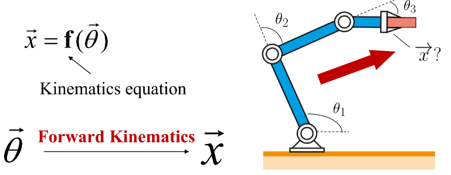

##### - Direction II: Inverse Kinematics 逆向运动学：一种数学过程，从其他数据比如笛卡尔坐标系下的空间位姿中恢复物体的运动参数，常用于机器人技术。
• Definition: Given a position and orientation of the end-effector, find the corresponding joint variables of the robot manipulator. 给定末端执行器的位置和姿态，求出机器人机械臂相应的关节变量。
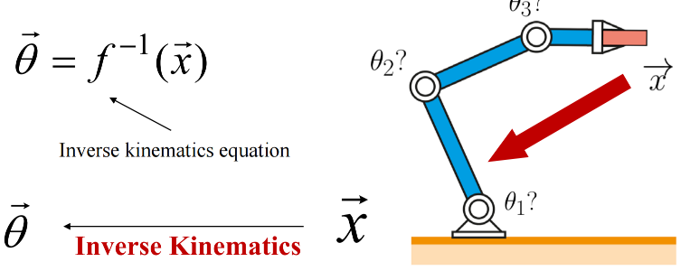

### 1.1.3 Forward Kinematics - 正向运动学 <a id="Forward-Kinematics"></a>


### 1.1.4 Inverse Kinematics - 逆向运动学 <a id="Inverse-Kinematics"></a>


### 1.1.5 Velocity Kinematics - 速度运动学 <a id="Velocity-Kinematics"></a>


## 1.2 Control - 控制 <a id="Control"></a>

### 1.2.1 Concepts - 概念与术语 <a id="Control-Concepts"></a>


### 1.2.2 Control System - 控制系统 <a id="Control-System"></a>


### 1.2.3 Controller - 控制器 <a id="Controller"></a>

#### 1.2.3.1 LQR Controller - LQR 控制器 <a id="LQR"></a>


#### 1.2.3.2 P.I.D. Controller - P.I.D. 控制器 <a id="PID"></a>


## 1.3 Planning - 规划 <a id="Planning"></a>

### 1.3.1 Intro to Trajectory and Motion Planning - 轨迹与运动规划入门 <a id="Intro-to-Trajectory-and-Motion-Planning"></a>
'The problem of calculating and generating the robot’s future motion sequence is called “planning”' 计算和生成机器人未来运动序列的问题被称为“规划”。
- Trajectory and motion planning are essential components in the field of robotics and autonomous systems. They involve determining the sequence of movements a robot must execute to perform a task effectively and safely within its environment. 轨迹和运动规划是机器人和自主系统领域的重要组成部分。它们包括确定机器人必须执行的动作顺序，以便在其环境中有效安全地执行任务。
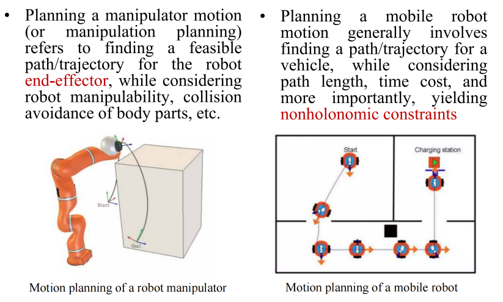

- End-effector motion planning: To generate in- between configurations given its initial and final configurations (or poses) 末端执行器运动规划：给定其初始和最终构型（或姿态）生成中间构型

- Planning results could directly affect the robot’s automation performance 规划结果会直接影响机器人的自动化性能

- Constraints include safety(Obstacle avoidance, singularity avoidance), efficiency(Fast tasks in industry), economy(To generate lowest cost), etc. 约束包括安全性（避障，奇异点规避），效率（工业中的快速任务），经济性（产生最低成本）等。

##### There are different types of planning problems: 不同类型的规划问题
• Motion Planning 运动规划; • Path Planning 路径规划; • Trajectory Planning 轨迹规划
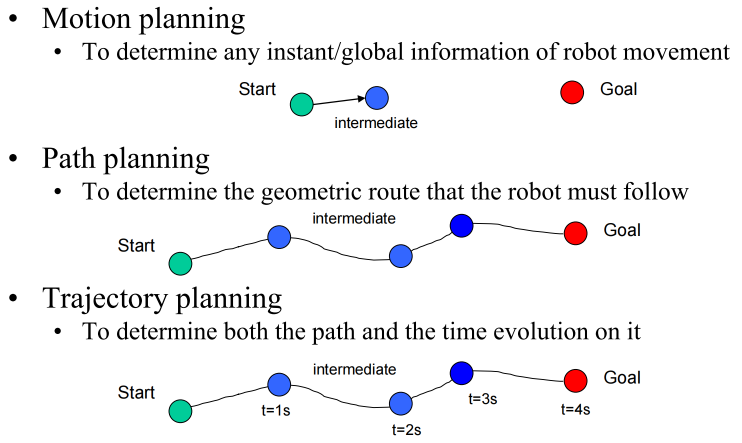
- Relationship
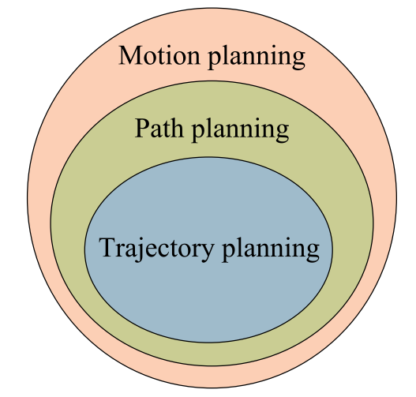

##### Components in planning 规划的组成部分
• Boundary constraints 边界限制/约束; • Motion geometric profiles 运动几何轮廓; • Other constraints 其他约束

##### Trajectory generation 轨迹生成


### 1.3.2 Search-Based Methods - 基于搜索的方法 <a id="Search-Based-Methods"></a>
- Dijkstra’s method 迪杰斯特拉算法
  - From the starting point, search every adjacent point in each new step until reaching the goal, then find the shortest path among all the goal-reachable solutions. 从起始点开始，在每一步中搜索每个相邻点，直至到达目标点，然后从所有能够到达目标点的方案中找出最短路径。
  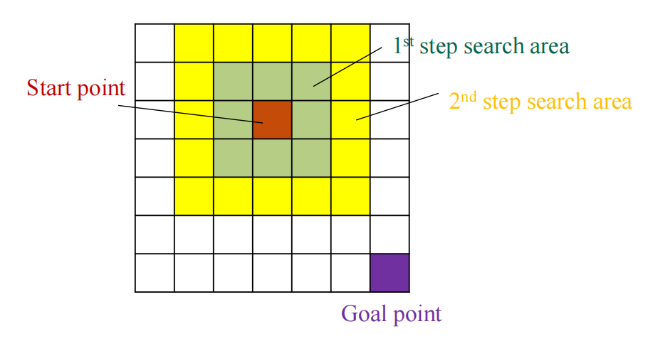

- A* method A星算法
  - From the starting point, find the adjacent point and select the point with the lowest cost as a new starting point until reaching the goal. 从起点开始，寻找相邻的点，选择代价最低的点作为新的起点，直到到达目标。
  - It is a more efficient version of Dijkstra’s method. 它是迪杰斯特拉算法的一个更有效的版本。
  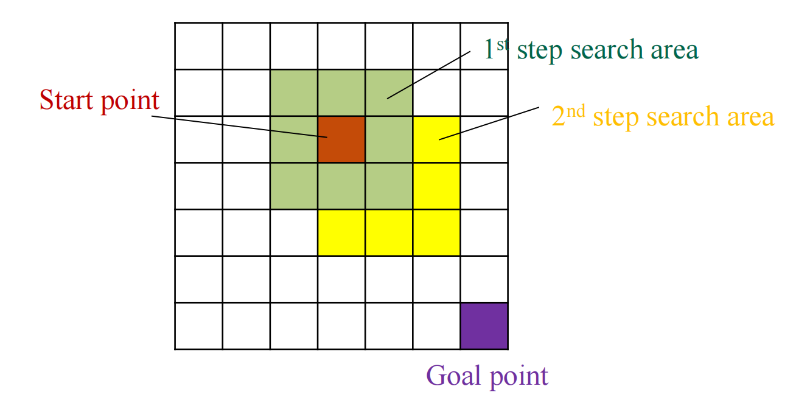
  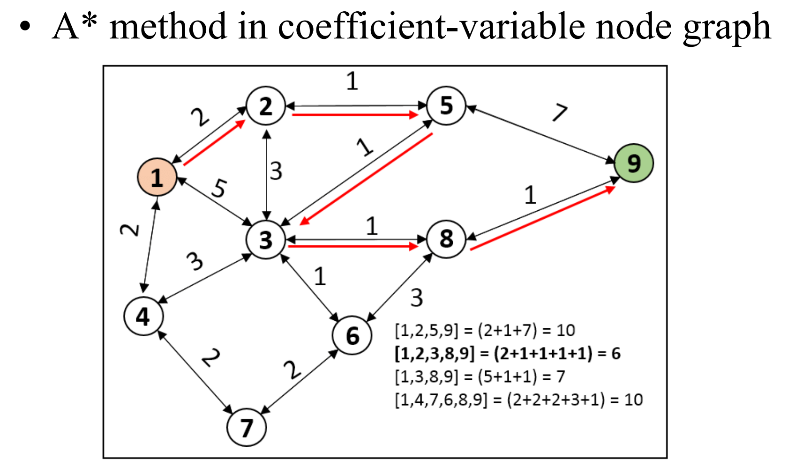
##### Comparison 比较
  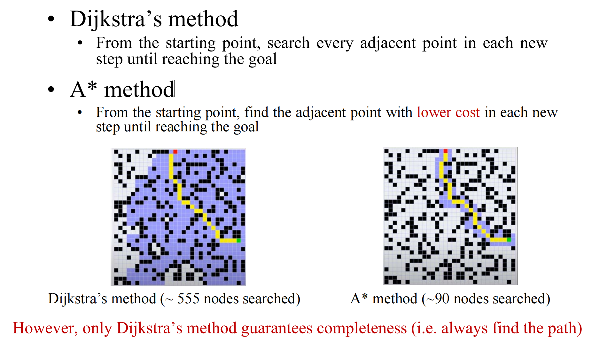

### 1.3.3 Sampling-Based Methods - 基于采样的方法 <a id="Sampling-Based-Methods"></a>
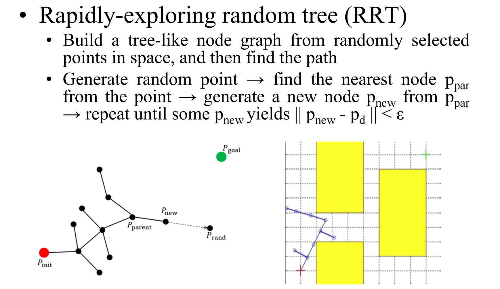

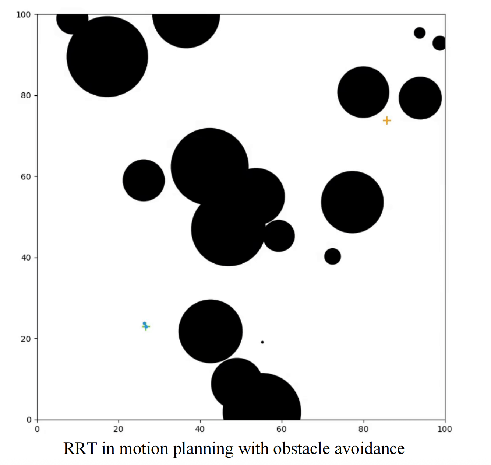

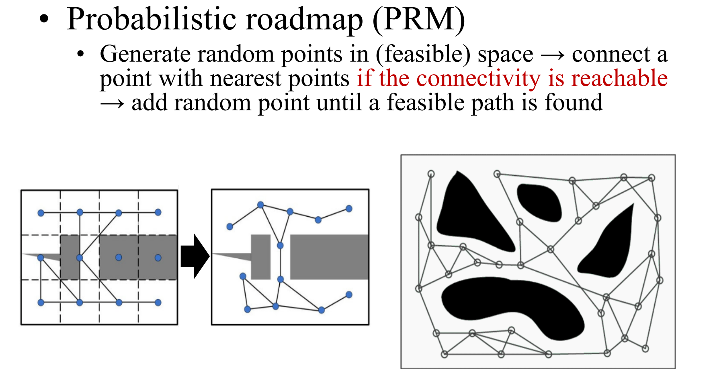

### Summary so far
- Search-based methods need to discretize the space first, and are generally used in low-dimensional space and could be inefficient in e.g. 6-DoF space 基于搜索的方法需要首先将空间离散化，通常用于低维空间，在6自由度空间中可能效率低下
  - Typical applications: Character moving in video games, decision making in AI, etc. 典型应用：电子游戏中的角色移动，AI中的决策制定等。
- Sampling-based methods do not need to discretize the space, and is workable in high-dimensional space 基于采样的方法不需要对空间进行离散化，在高维空间中是可行的
  - Typical applications: Manipulator grasping, pick-and-place, etc. 典型应用：机械手抓取、取放等。
- However, the above methods requires to know all the possible constraints appear in the whole space (e.g. obstacle positions and shapes, space limits) 然而，上述方法需要知道整个空间中出现的所有可能的约束（例如障碍物的位置和形状，空间限制）。
- Unable to reliably deal with dynamic constraints 无法可靠地处理动态约束

### 1.3.4 Geometry-Based Methods - 基于几何学的方法 <a id="Geometry-Based-Methods"></a>
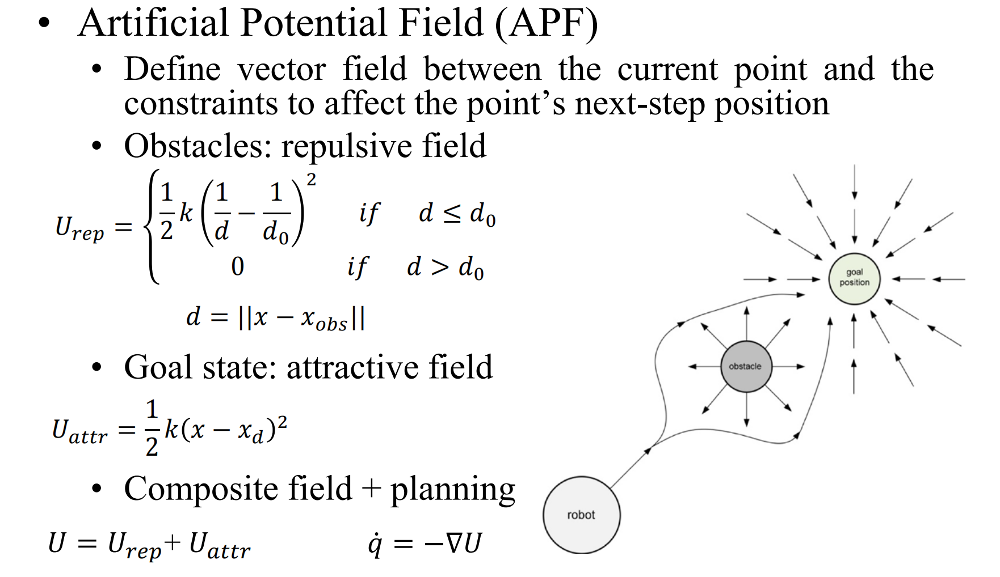
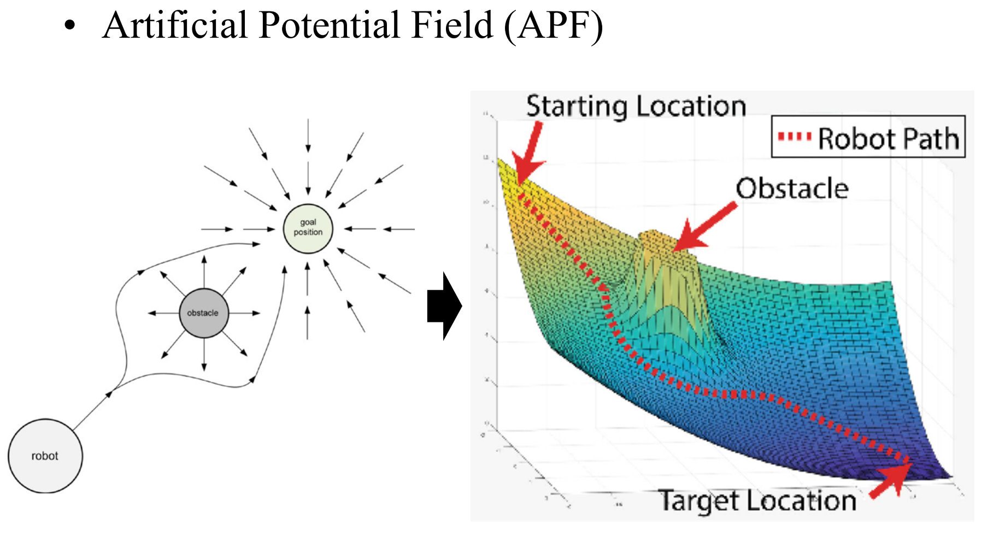

### 1.3.5 Optimization-Based Methods - 基于最优化的方法 <a id="Optimization-Based-Methods"></a>
- Generate an initial motion profile for the robot, followed by online refinement of it using global/local optimization
- Example: CHOMP (Covariant Hamiltonian Optimization for Motion Planning)
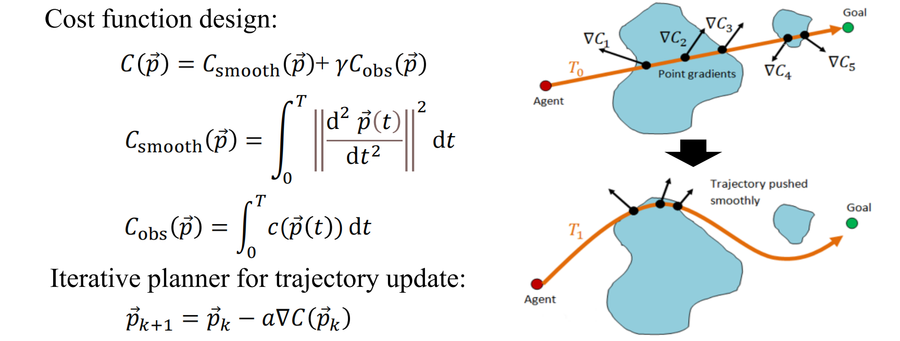
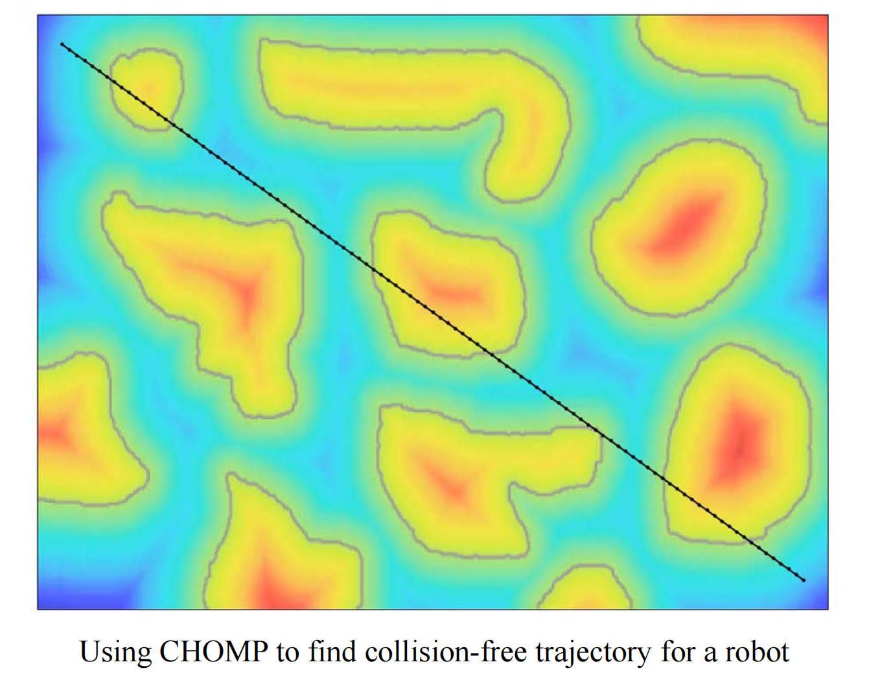

#### 1.3.5.1 Model Predictive Control - 模型预测控制 <a id="Model-Predictive-Control"></a>
- Using system model to online adjust its future behavior within a limited (future) time horizon using optimization. 利用系统模型在有限的（未来）时间范围内对其未来行为进行在线优化。

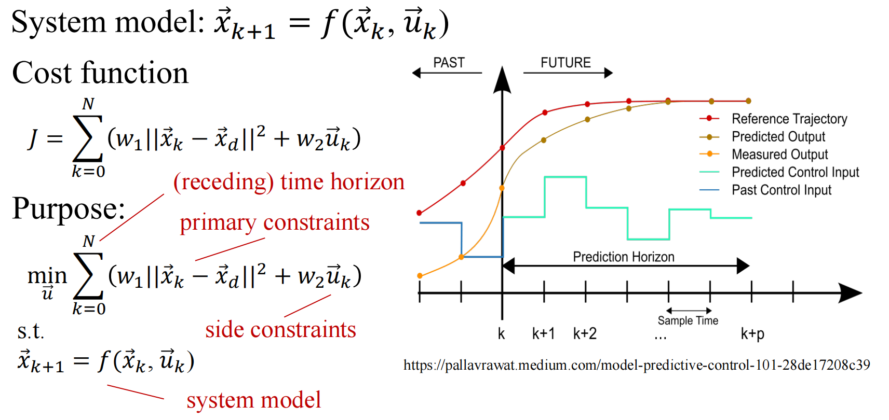

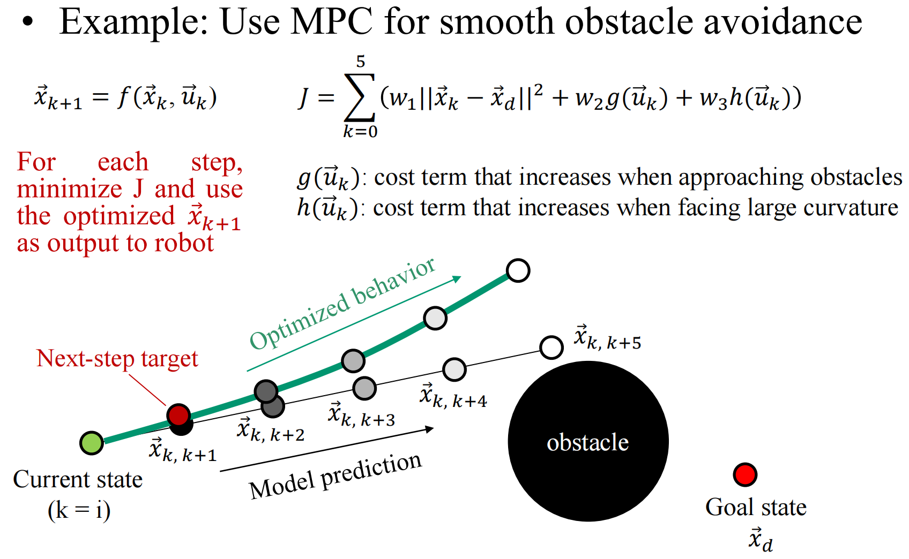

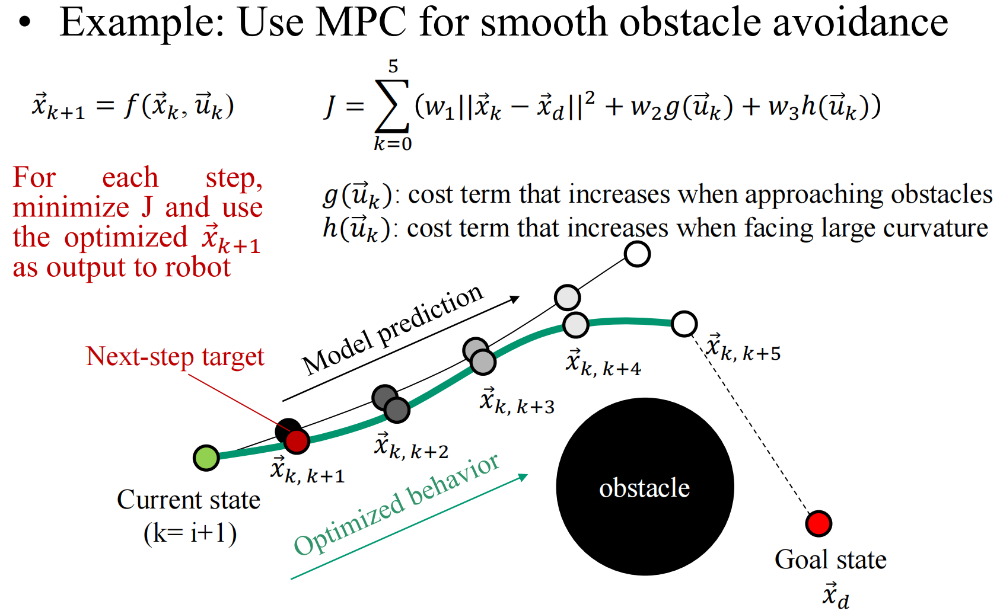

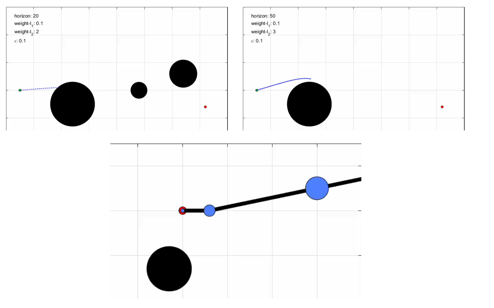

- MPC is one of the most popular methods for integrated motion planning (by enforcing t→∞). MPC是最流行的综合运动规划方法之一（通过强制t→∞）。
- Advantages 优势
  - Could plan future motions under various and dynamic constraints 能在各种的和动态的约束下规划未来的运动
  - Could be efficient within short time horizon 能在短时间视野内高效
- Applications 应用
  - Iron boiler temperature control 铁锅炉温度控制
  - L2 Autonomous driving L2自动驾驶
  - Drone formation flying 无人机编队飞行
- Robot Tasks 机器人的任务
  - Human-robot safe collaboration (robot manipulators) 人机安全协作（机械手）
  - Dynamic planning in human crowd (mobile robots) 人群动态规划（移动机器人）

##### 1.3.5.1.1 Markovian Decision Process - 马尔可夫决策过程 <a id="Markovian-Decision-Process"></a>

**Markov Process** is a stochastic model describing how a system evolves over time, characterized by the **memoryless property**: the future state depends only on the current state, not the past history. It forms the foundation of environment modeling in robotics and reinforcement learning. **马尔可夫过程**是描述系统状态随时间演化的一种随机模型，其核心特性是**无记忆性**，即未来的状态仅依赖于当前状态，与过去的状态无关。它是机器人学和强化学习中环境建模的基础。

- **Markov Property 马尔可夫性质**：\( P(s_{t+1} | s_t) = P(s_{t+1} | s_1, s_2, \ldots, s_t) \)
- **Applications 应用**：
  - **Markov Decision Process 马尔可夫决策过程 (MDP)**：A key framework in reinforcement learning. 强化学习中常用的环境建模框架。
  - Robot path planning and decision-making. 机器人路径规划和决策。
  - Dynamic system modeling. 动态系统建模。

### Summary
- Search-based methods 基于搜索的方法
  - pros：
    - Easy to implement 容易执行
  - cons：
    - Only efficient in low-dimensional space 只在低维空间有效
- Sampling-based methods 基于采样的方法
  - pros：
    - Could scalability in arbitrary space 任意空间的可伸缩性
    - Completeness of path finding (given enough time) 路径查找的完整性（给定足够的时间）
  - cons：
    - Planning time cost is too random to predict 规划的时间成本/所花费的时间是随机的，无法预测
- Geometry-based methods 基于几何学的方法
  - pros：
    - Model is simple and very efficient 模型简单，效率高
  - cons：
    - Chances to be trapped in local minima 有可能被困在局部极小值
- Optimization-based methods 基于最优化的方法
  - pros：
    - Could be reactive to complex and dynamic situations 能够对复杂和动态的情况做出反应
  - cons：
    - Performance depends on model initialization 性能取决于模型初始化


## 1.4 Perception - 感知 <a id="Perception"></a>

### 1.4.1 Kalman Filter - 卡尔曼滤波器 <a id="Kalman-Filter"></a>

 ###### - [卡尔曼滤波从理论到实践 华工机器人实验室](https://www.bilibili.com/video/BV1Rh41117MT?spm_id_from=333.788.videopod.episodes&vd_source=180b6da13847c26de9d19ac71e61c7fe&p=2) 课程分为‘滤波概要’，‘基本滤波知识储备’，‘通俗公式理解’和‘从理论到实践’四个章节。适合新手入门。

### Introduction

The **Kalman Filter** is a mathematical algorithm that provides an efficient computational solution to estimate the state of a dynamic system from a series of incomplete and noisy measurements. It is widely used in control systems, navigation, signal processing, and econometrics due to its ability to extract useful information from noisy data. **卡尔曼滤波**是一种数学算法，它提供了一种有效的计算解决方案，从一系列不完整和有噪声的测量中估计动态系统的状态。由于它能够从噪声数据中提取有用的信息，因此被广泛应用于控制系统、导航、信号处理和计量经济学中。

**Kalman Filter** is a recursive estimation algorithm used to optimize the estimation of a dynamic system's state, particularly under noisy conditions. It is widely applied in robotics for localization, navigation, and sensor fusion. **卡尔曼滤波**是一种递归估计算法，用于优化动态系统的状态估计，特别是在存在噪声的情况下。它被广泛应用于机器人学中的定位、导航和传感器数据融合。

- **Features 特点**：
  - Works for linear systems. 适用于线性系统。
  - Assumes Gaussian noise. 假设噪声为高斯分布。
- **Steps 步骤**：
  1. **Prediction 预测**：Predict the next state using the system model. 根据系统模型预测下一状态。
  2. **Update 更新**：Correct the prediction using measurement data. 结合测量值修正预测值。
- **Applications 应用**：
  - Robot localization (e.g., SLAM: Simultaneous Localization and Mapping). 机器人定位（SLAM：同步定位与建图）。
  - Sensor fusion (e.g., combining IMU and GPS data). 传感器数据融合（如 IMU 和 GPS 数据的结合）。


### 1.4.1.1. What is the Kalman Filter?

#### 1.4.1.1.1. Overview


The Kalman Filter is a recursive estimator that estimates the state of a discrete-time controlled process governed by a linear stochastic difference equation. It operates in a two-step process: 卡尔曼滤波器是一种递归估计器，用于估计由线性随机差分方程控制的离散时间控制过程的状态。它分为两步：

1. **Prediction Step:** The filter produces estimates of the current state variables, along with their uncertainties.   **预测步骤：** 过滤器产生当前状态变量的估计，以及它们的不确定性。
2. **Update Step (Correction):** Once a new measurement is observed, these predictions are updated using a weighted average, with more weight given to estimates with higher certainty.   **更新步骤（修正）：** 一旦观察到新的测量结果，这些预测将使用加权平均值进行更新，并将更多的权重赋予具有更高确定性的估计。

#### 1.4.1.1.2. Mathematical Foundations

The Kalman Filter assumes the following: 卡尔曼滤波器假设如下

- The system is **linear**. 该系统是线性的。
- The **system dynamics and measurement equations** are known. **系统动力学和测量方程**是已知的。
- The process noise and measurement noise are both **Gaussian**, with zero mean and known covariance. 过程噪声和测量噪声均为**高斯噪声**，均值为零，协方差已知。

**State-Space Representation 状态空间表示:** 

<!-- The system can be represented in state-space form: 系统可以用状态空间的形式表示：

1. **State Equation (Process Model) 状态方程（过程模型）:**
   \[
   \mathbf{x}_{k} = \mathbf{A}_{k}\mathbf{x}_{k-1} + \mathbf{B}_{k}\mathbf{u}_{k} + \mathbf{w}_{k}
   \]

2. **Measurement Equation 测量方程:**
   \[
   \mathbf{z}_{k} = \mathbf{H}_{k}\mathbf{x}_{k} + \mathbf{v}_{k}
   \]

**Where:**

- \(\mathbf{x}_{k}\): State vector at time \(k\). 时间\(k\)时的状态向量。
- \(\mathbf{A}_{k}\): State transition matrix. 状态转移矩阵。
- \(\mathbf{u}_{k}\): Control input vector. 控制输入向量。
- \(\mathbf{B}_{k}\): Control input matrix. 控制输入矩阵。
- \(\mathbf{w}_{k}\): Process noise (assumed to be Gaussian with covariance \(\mathbf{Q}_{k}\)). 过程噪声（假设为高斯（分布），协方差为\(\mathbf{Q}_{k}\)）。
- \(\mathbf{z}_{k}\): Measurement vector at time \(k\). 在时间\(k\)的测量向量。
- \(\mathbf{H}_{k}\): Measurement matrix. 测量矩阵。
- \(\mathbf{v}_{k}\): Measurement noise (assumed to be Gaussian with covariance \(\mathbf{R}_{k}\)). 测量噪声（假设为高斯（分布），协方差为\(\mathbf{R}_{k}\)）。 -->
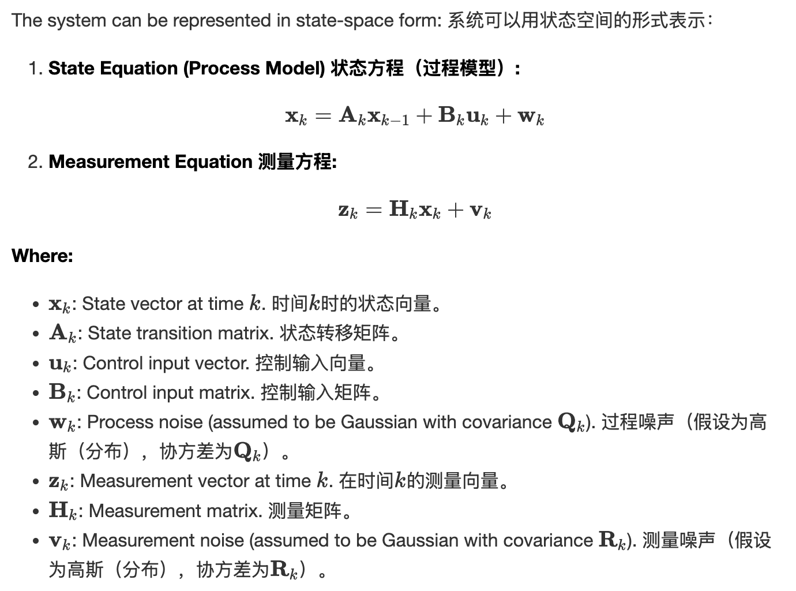

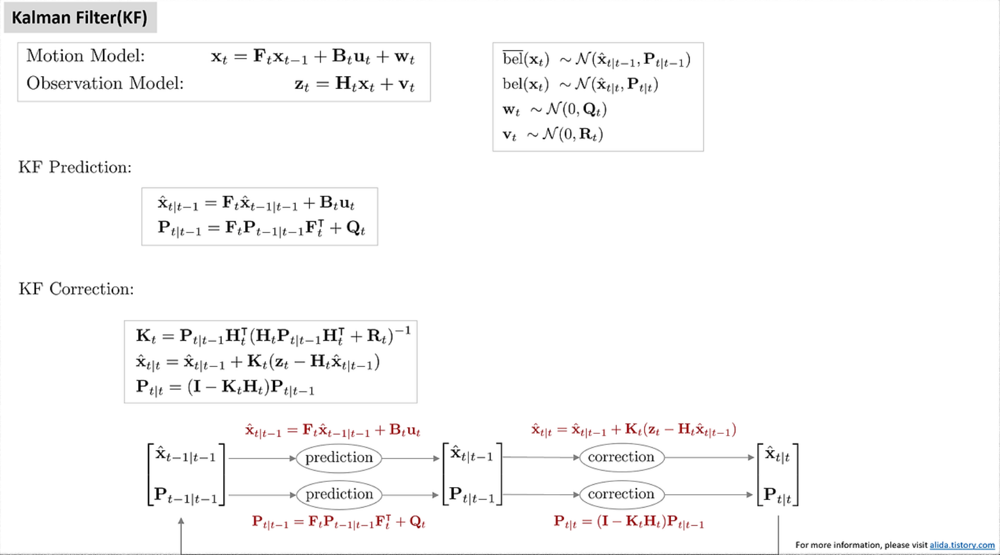


#### 1.4.1.1.3. Applications for Linear Kalman Filter

- **Finance 金融:** Estimating market trends and filtering economic indicators. 估计市场趋势，过滤经济指标。
- **Signal Processing 信号处理:** Noise reduction in signals, system identification. 信号降噪，系统识别。
- **Control Systems 控制系统:** Classical control applications with linear dynamics. 经典控制应用与线性动力学。

### 1.4.1.2. Variants of the Kalman Filter 卡尔曼滤波器的变体

Due to limitations in the basic Kalman Filter (e.g., linearity assumptions), several variants have been developed to handle nonlinear systems, improve numerical stability, and address specific application requirements. 由于基础的卡尔曼滤波器的局限性（例如，线性假设），已经开发了几种变体来处理非线性系统，提高数值稳定性，并满足特定的应用要求。

#### 1.4.1.2.1. Extended Kalman Filter (EKF) 扩展卡尔曼滤波

##### 1.4.1.2.1.1. Overview

The EKF linearizes the nonlinear system around the current estimate using Taylor series expansion. It approximates the system dynamics and measurement equations to first-order terms. EKF利用泰勒级数展开对当前估计周围的非线性系统进行线性化。它将系统动力学和测量方程近似为一阶项。

##### 1.4.1.2.1.2. Mathematical Formulation 数学公式

<!-- For a system described by nonlinear functions: 对于由非线性函数描述的系统：

- **Process Model 流程模型:**
  \[
  \mathbf{x}_{k} = f(\mathbf{x}_{k-1}, \mathbf{u}_{k}) + \mathbf{w}_{k}
  \]

- **Measurement Model 测量模型:**
  \[
  \mathbf{z}_{k} = h(\mathbf{x}_{k}) + \mathbf{v}_{k}
  \]

EKF（扩展卡尔曼滤波）使用雅可比矩阵对\(f\)和\(h\)进行线性化 The EKF uses Jacobian matrices to linearize \(f\) and \(h\):

- **State Transition Jacobian 状态转移雅可比矩阵:**
  \[
  \mathbf{F}_{k} = \left. \frac{\partial f}{\partial \mathbf{x}} \right|_{\hat{\mathbf{x}}_{k-1}}
  \]

- **Measurement Jacobian 测量雅可比矩阵:**
  \[
  \mathbf{H}_{k} = \left. \frac{\partial h}{\partial \mathbf{x}} \right|_{\hat{\mathbf{x}}_{k}}
  \] -->
  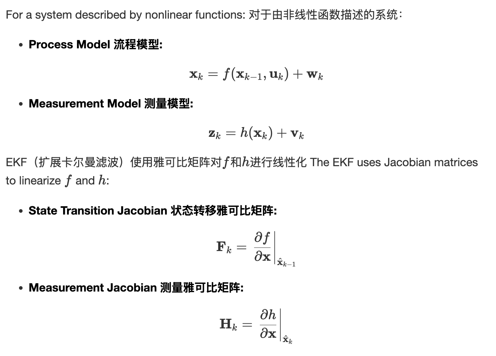

  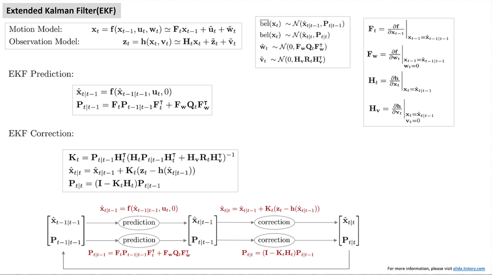

##### 1.4.1.2.1.3. Applications 应用

- **Navigation Systems 导航系统:** Aerospace and marine navigation where the motion dynamics are nonlinear. 运动动力学非线性的航空航天和航海。
- **Robotics 机器人学:** Mobile robot localization and mapping (SLAM). 移动机器人定位与制图（SLAM）。
- **Tracking Systems 追踪系统:** Radar and sonar tracking of maneuvering targets. 机动目标的雷达和声纳跟踪。
- **Biomedical Engineering 生物医学工程:** Heart rate estimation from noisy measurements. 从噪声测量中估计心率。

#### 1.4.1.2.2. Unscented Kalman Filter (UKF) 无迹卡尔曼滤波器

##### 1.4.1.2.2.1. Overview

The UKF addresses the inaccuracies arising from linearization in the EKF by using deterministic sampling (sigma points) to capture the mean and covariance estimates more accurately. UKF通过使用确定性采样（西格玛点）来更准确地捕获平均值和协方差估计，从而解决了EKF中线性化引起的不准确性。

##### 1.4.1.2.2.2. Sigma Points 西格马点

The UKF generates a set of sigma points that are propagated through the nonlinear functions UKF生成一组sigma点，这些点通过非线性函数传播：:

- Captures up to the second-order statistics of the Gaussian distribution. 捕获高斯分布的二阶统计量。
- Provides better approximations for nonlinear transformations. 为非线性变换提供更好的近似。

##### 1.4.1.2.2.3. Applications 应用

- **Nonlinear Control Systems 非线性控制系统:** Where higher accuracy is needed over the EKF. 需要比EKF更高精度的地方。
- **sensor fusion 传感器融:** Combining data from multiple sensors with nonlinear measurements. 将多个传感器的数据与非线性测量相结合。
- **Autonomous Vehicles 自动驾驶车辆:** State estimation in complex dynamic environments. 复杂动态环境下的状态估计。

#### 1.4.1.2.3. Error-State Kalman Filter (ESKF) 误差状态卡尔曼滤波器

##### 1.4.1.2.3.1. Overview

The ESKF estimates the error between the estimated state and the true state, rather than estimating the state directly. This is particularly useful for systems where the state variables exhibit slow changes or when initial estimates are available. ESKF估计 估计状态 和 真实状态 之间的误差，而不是直接估计状态。这对于状态变量表现出缓慢变化或初始估计可用的系统特别有用。

##### 1.4.1.2.3.2. Mathematical Formulation 数学公式

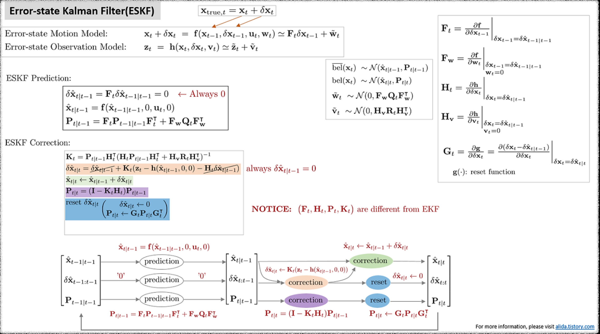

##### 1.4.1.2.3.3. Advantages 优势

- **Numerical Stability 数值稳定性:** By focusing on small errors, numerical issues due to large state values are minimized. 通过关注小误差，由于大状态值的数值问题被最小化。
- **Simplified Linearization 简化线性化:** The error dynamics are often more linear than the state dynamics, simplifying the computation. 误差动力学通常比状态动力学更线性，简化了计算。

##### 1.4.1.2.3.4. Applications 应用


- **Mobile Robotics 移动机器人:** High-precision localization in GPS-denied environments. 在gps拒绝的环境中进行高精度定位。
- **Virtual Reality (VR) 虚拟现实:** Head and motion tracking for immersive experiences. 沉浸式体验的头部和运动跟踪。
- **Inertial Measurement Unit (IMU) Integration 惯性测量单元（IMU）集成:** Correcting drift errors in accelerometers and gyroscopes. 修正加速度计和陀螺仪的漂移误差。
- **Inertial Navigation Systems (INS) 惯性导航系统:** Where small errors in position, velocity, and orientation need to be accurately estimated. 需要精确估计位置、速度和方向的小误差。
- **Robotics 机器人:** Precise localization and mapping, especially in SLAM applications. 精确定位和绘图，特别是在SLAM应用中。
- **Aerospace 航空航天:** Attitude estimation for aircraft and satellites. 飞机和卫星的姿态估计。

#### 1.4.1.2.4. Square Root Kalman Filter (SRKF) 平方根卡尔曼滤波

##### 1.4.1.2.4.1. Overview

The SRKF maintains the square root of the covariance matrix to improve numerical stability. SRKF保持协方差矩阵的平方根以提高数值稳定性。

##### 1.4.1.2.4.2. Advantages 优势

- **Numerical Stability 数值稳定性:** Avoids direct computation of the covariance matrix, reducing round-off errors. 避免直接计算协方差矩阵，减少舍入误差。
- **Positive Definiteness  正定性:** Ensures the covariance matrix remains positive definite. 确保协方差矩阵保持正定。

##### 1.4.1.2.4.3. Applications 应用

- **High-Precision Systems 高精度的系统:** Where numerical errors can accumulate over time. 随着时间的推移，数值误差会累积。
- **Space Missions 太空任务:** Deep space navigation where precision is critical. 精度至关重要的深空导航。
- **Large-Scale Systems:** With significant computational demands. 有大量的计算需求。


#### 1.4.1.2.5. Information Filter (Inverse Covariance Filter) 信息滤波（逆协方差滤波）

##### 1.4.1.2.5.1. Overview

The Information Filter operates on the information matrix (inverse of the covariance matrix) and information vector. 信息过滤器对信息矩阵（协方差矩阵的逆）和信息向量进行操作。

##### 1.4.1.2.5.2. Advantages 优势

- **Sparsity Exploitation 稀疏剥削:** Efficient for systems where the information matrix is sparse. 对于信息矩阵稀疏的系统是有效的。
- **Distributed Estimation 分布估计:** Facilitates decentralized estimation in networked systems. 促进网络系统中的分散估计。

##### 1.4.1.2.5.3. Applications 应用

- **Sensor Networks 传感器网络:** Distributed state estimation. 分布式状态估计
- **Multi-Robot Systems 多机器人系统:** Where robots share information to estimate a common state. 机器人共享信息来估计一个共同的状态。

#### 1.4.1.2.6. Ensemble Kalman Filter (EnKF) 集合卡尔曼滤波器

##### 1.4.1.2.6.1. Overview

The EnKF uses a Monte Carlo approach with an ensemble of random samples to estimate the state distribution. EnKF使用蒙特卡罗方法和随机样本集合来估计状态分布。

##### 1.4.1.2.6.2. Applications 应用

- **Meteorology 气象学:** Weather prediction and climate modeling. 天气预报和气候模拟。
- **Oceanography 海洋学:** Estimating ocean states from sparse measurements. 从稀疏测量估计海洋状态。

#### 1.4.1.2.7. Particle Filter (Sequential Monte Carlo Methods) 粒子滤波（顺序蒙特卡罗方法）

Although not a Kalman filter, particle filters are similar recursive Bayesian estimators suitable for highly nonlinear and non-Gaussian systems. 虽然不是卡尔曼滤波器，但粒子滤波器是类似于适用于高度非线性和非高斯系统的递归贝叶斯估计。


### 1.4.1.3. Choosing the Appropriate Kalman Filter Variant 选择合适的卡尔曼滤波器变体

#### 1.4.1.3.1. System Linearity 系统线性
- **Linear Systems 线性系统:** Use the standard Kalman Filter. 使用标准的卡尔曼滤波器。
- **Mildly Nonlinear Systems 轻度非线性系统:** EKF may suffice, but be cautious of linearization errors. EKF可能足够了，但要小心线性化误差。
- **Highly Nonlinear Systems 高度非线性系统:** UKF or particle filters are more appropriate. UKF(Unscented Kalman Filter)无迹卡尔曼滤波或粒子过滤器更合适。

#### 1.4.1.3.2. Computational Resources 计算资源

- **Limited Resources 有限资源:** EKF is less computationally intensive than UKF. 与UKF相比，EKF的计算强度更小。
- **High Accuracy Needed 需要高精度:** UKF provides better estimates at the expense of computation. UKF以计算为代价提供更好的估计。

#### 1.4.1.3.3. Noise Characteristics 噪声特性

- **Gaussian Noise 高斯噪声:** Standard KF, EKF, UKF assume Gaussian noise. 标准KF， EKF， UKF假设高斯噪声。
- **Non-Gaussian Noise 非高斯噪声:** Particle filters or other nonlinear estimators are preferable. 粒子滤波器或其他非线性估计器是优选的。

#### 1.4.1.3.4. Application Requirements 应用需求

- **Precision vs. Speed 精度vs速度:** SRKF is preferred for precision, while standard KF is faster. SRKF精度较高，而标准KF速度更快。
- **Distributed Systems 分布式系统:** Information Filters are suitable for decentralized estimation. 信息过滤器适用于分散估计。


### 1.4.1.5. Kalman Filter Algorithm Steps 卡尔曼滤波算法步骤

#### 1.4.1.5.1. Standard Kalman Filter Steps 标准卡尔曼滤波步骤
##### 

<!-- **State-Space Representation 状态空间表示:** 
 -->

<!-- 1. **Initialization 初始化:**
   - Set initial state estimate \(\hat{\mathbf{x}}_{0}\) and covariance \(\mathbf{P}_{0}\).

2. **Prediction Step 预测步骤:**
   - Predict the next state 预测下一个状态:
     \[
     \hat{\mathbf{x}}_{k|k-1} = \mathbf{A}_{k}\hat{\mathbf{x}}_{k-1|k-1} + \mathbf{B}_{k}\mathbf{u}_{k}
     \]
   - Predict the covariance 预测协方差:
     \[
     \mathbf{P}_{k|k-1} = \mathbf{A}_{k}\mathbf{P}_{k-1|k-1}\mathbf{A}_{k}^{T} + \mathbf{Q}_{k}
     \]

3. **Update Step 更新步骤:**
   - Compute the Kalman Gain 计算卡尔曼增益:
     \[
     \mathbf{K}_{k} = \mathbf{P}_{k|k-1}\mathbf{H}_{k}^{T}(\mathbf{H}_{k}\mathbf{P}_{k|k-1}\mathbf{H}_{k}^{T} + \mathbf{R}_{k})^{-1}
     \]
   - Update the estimate with measurement \(\mathbf{z}_{k}\) 用测量 \(\mathbf{z}_{k}\)更新估计:
     \[
     \hat{\mathbf{x}}_{k|k} = \hat{\mathbf{x}}_{k|k-1} + \mathbf{K}_{k}(\mathbf{z}_{k} - \mathbf{H}_{k}\hat{\mathbf{x}}_{k|k-1})
     \]
   - Update the covariance 更新协方差:
     \[
     \mathbf{P}_{k|k} = (\mathbf{I} - \mathbf{K}_{k}\mathbf{H}_{k})\mathbf{P}_{k|k-1}
     \] -->
  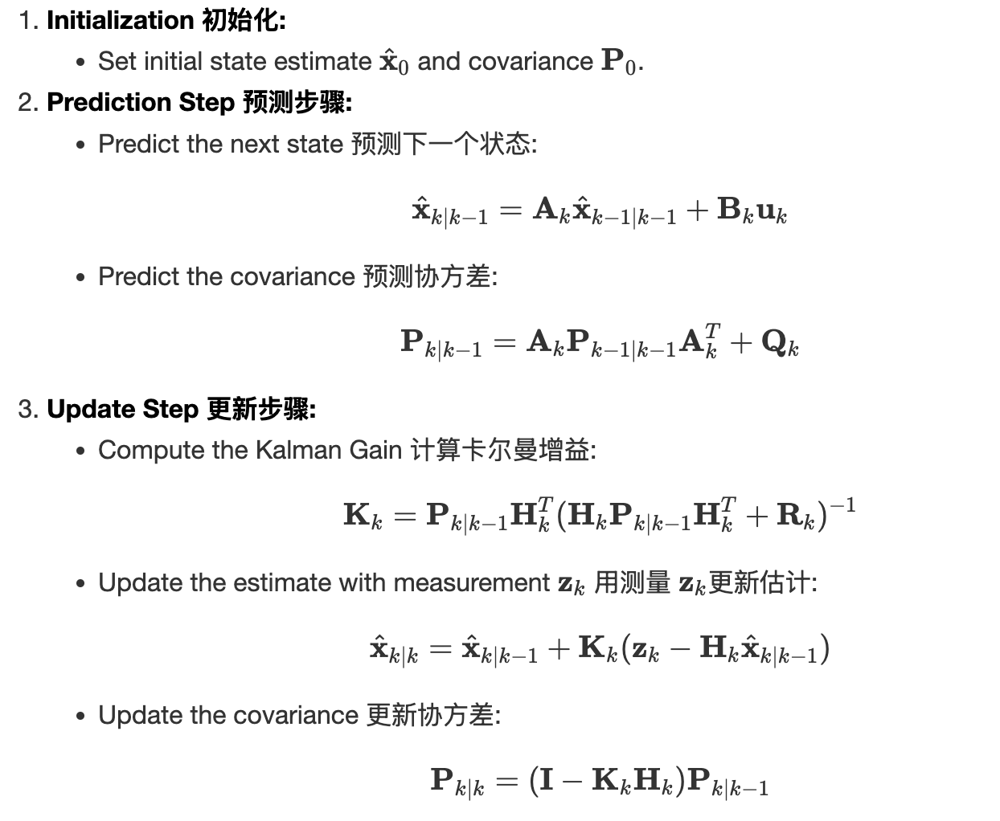

---

The following is a detailed step-by-step explanation of the above Kalman filter algorithm steps, including the definition of each symbol and its corresponding relationship in the formula: 以下是上述卡尔曼滤波算法步骤的详细分步解释，包含每个符号的定义及其在公式中的对应关系：

#### **1. Initialization 初始化**
<!-- - **Symbol Definition 符号定义**：
  - \(\hat{\mathbf{x}}_{0}\): Initial state estimation (such as the initial position and speed of the robot). 初始状态估计（如机器人的初始位置、速度）。
  - \(\mathbf{P}_{0}\): The initial state covariance matrix represents the uncertainty of the initial estimation (the diagonal elements are the variance, and the non-diagonal elements are the correlations between states). 初始状态协方差矩阵，表示初始估计的不确定性（对角线元素为方差，非对角线为状态间的相关性）。
- **作用 Role**：  
  Provide the starting point of the filter, and the subsequent steps will be gradually updated based on this. 提供滤波器的起点，后续步骤将基于此逐步更新。 -->
  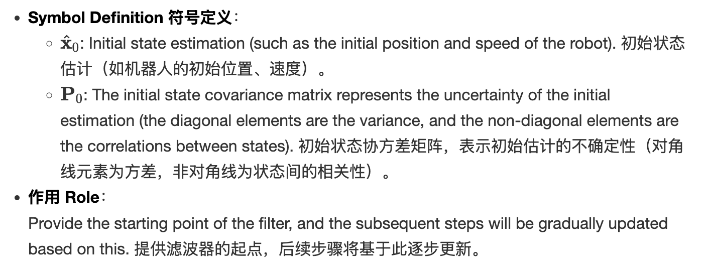

#### **2. Prediction Step 预测步骤**
<!-- #### **(1) State Prediction 状态预测**
\[
\hat{\mathbf{x}}_{k|k-1} = \mathbf{A}_{k}\hat{\mathbf{x}}_{k-1|k-1} + \mathbf{B}_{k}\mathbf{u}_{k}
\]
- **符号定义**：
  - \(\hat{\mathbf{x}}_{k|k-1}\): **Prior state estimation** at time \(k\) (without considering the current measurement). 在时间 \(k\) 的**先验状态估计**（未考虑当前测量）。
  - \(\mathbf{A}_{k}\): **State transition matrix** (describing how the system evolves from the \(k-1\) moment to the \(k\) moment, such as kinematic models). **状态转移矩阵**（描述系统如何从 \(k-1\) 时刻演化到 \(k\) 时刻，如运动学模型）。
  - \(\hat{\mathbf{x}}_{k-1|k-1}\): The posterior state estimation at time \(k-1\) (with the measurement from the previous time fused). \(k-1\) 时刻的**后验状态估计**（已融合上一时刻的测量）。
  - \(\mathbf{B}_{k}\): **Control input matrix** (mapping the control input \(\mathbf{u}_{k}\) to the state space, such as the influence of acceleration on velocity). **控制输入矩阵**（将控制输入 \(\mathbf{u}_{k}\) 映射到状态空间，如加速度对速度的影响）。
  - \(\mathbf{u}_{k}\): **Control input** (such as control signals for motors). **控制输入**（如电机的控制信号）。
- **Physical Significance 物理意义**：  
  Predict the current state based on the system dynamics and kinematics model. 基于系统动力学和运动学模型预测当前状态。 -->
  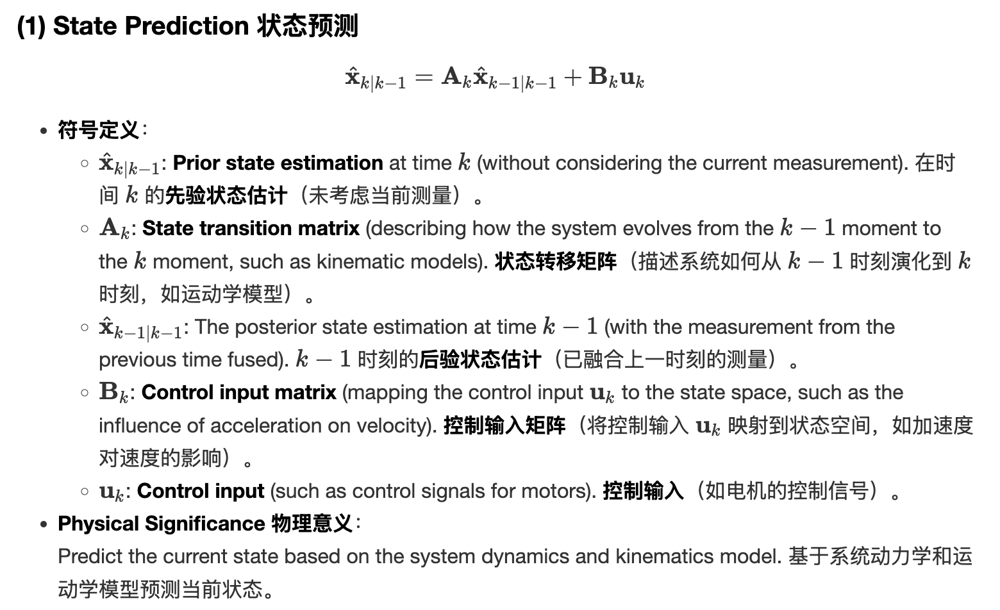

#### **(2) Covariance Prediction 协方差预测**
<!-- \[
\mathbf{P}_{k|k-1} = \mathbf{A}_{k}\mathbf{P}_{k-1|k-1}\mathbf{A}_{k}^{T} + \mathbf{Q}_{k}
\]
- **Symbol Definition 符号定义**：
  - \(\mathbf{P}_{k|k-1}\): Prior state covariance (uncertainty of prediction). 先验状态协方差（预测的不确定性）。
  - \(\mathbf{P}_{k-1|k-1}\): The posterior covariance at time \(k-1\). \(k-1\) 时刻的后验协方差。
  - \(\mathbf{Q}_{k}\): Process noise covariance (model error, such as unmodeled external disturbances). 过程噪声协方差（模型误差，如未建模的外部扰动）。
- **Physical Significance 物理意义**：  
  The uncertainty of prediction comes from two parts 预测的不确定性来自两部分：  
  1. The uncertainty of the previous moment is transmitted through \(\mathbf{A}_{k}\); 上一时刻的不确定性通过 \(\mathbf{A}_{k}\) 传递；  
  2. Process noise \(\mathbf{Q}_{k}\) adds additional uncertainty. 过程噪声 \(\mathbf{Q}_{k}\) 增加额外不确定性。 -->
  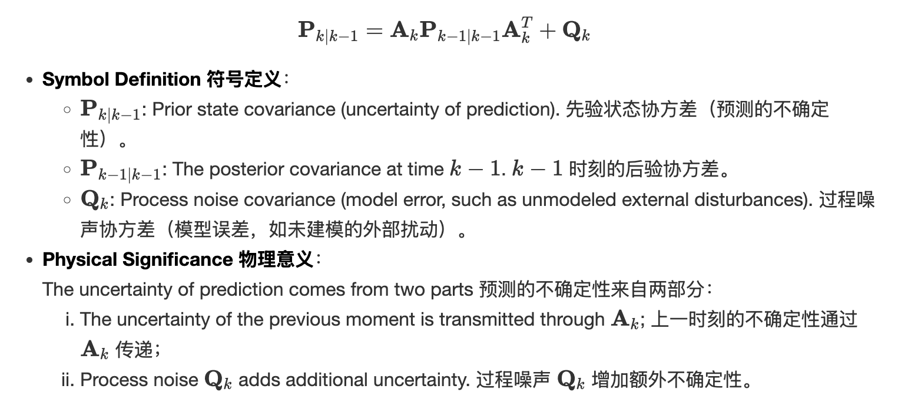

---

##### -> Derivation of the covariance prediction formula 协方差预测公式推导
<!-- The covariance prediction formula in Kalman filtering 卡尔曼滤波中的**协方差预测公式**：
\[
\mathbf{P}_{k|k-1} = \mathbf{A}_{k}\mathbf{P}_{k-1|k-1}\mathbf{A}_{k}^{T} + \mathbf{Q}_{k}
\]
Its derivation stems from **uncertainty propagation** and **Gaussian properties of linear systems**. The following are the detailed steps: 其推导源于**不确定性传播**和**线性系统的高斯性质**，以下是详细步骤： -->
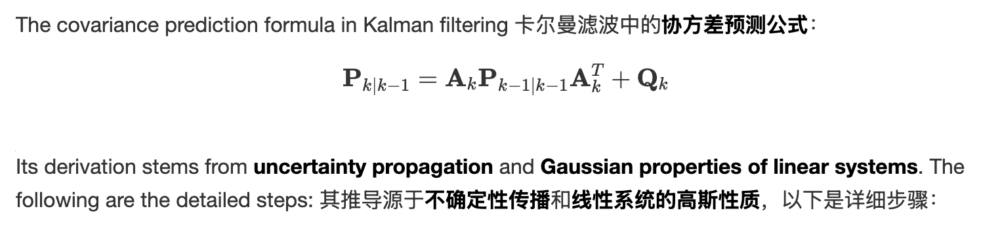

###### **1. Theoretical Basis 理论基础**
Suppose the system satisfies the following linear Gaussian model: 假设系统满足以下线性高斯模型：
<!-- - **State Equation 状态方程**：
  \[
  \mathbf{x}_k = \mathbf{A}_k \mathbf{x}_{k-1} + \mathbf{B}_k \mathbf{u}_k + \mathbf{w}_k, \quad \mathbf{w}_k \sim \mathcal{N}(0, \mathbf{Q}_k)
  \]
  Here, \(\mathbf{w}_k\) is the process noise, and the covariance is \(\mathbf{Q}_k\). 其中 \(\mathbf{w}_k\) 是过程噪声，协方差为 \(\mathbf{Q}_k\)。

- **State estimation of the previous moment 上一时刻的状态估计**：
  \[
  \hat{\mathbf{x}}_{k-1|k-1} \sim \mathcal{N}(\mathbf{x}_{k-1}, \mathbf{P}_{k-1|k-1})
  \] -->
  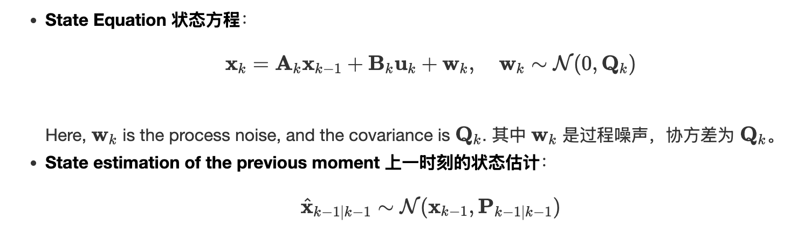

###### **2. The definition of the covariance of the predicted state 预测状态的协方差定义**
<!-- The covariance of the predicted state \(\hat{\mathbf{x}}_{k|k-1}\) is defined as: 预测状态 \(\hat{\mathbf{x}}_{k|k-1}\) 的协方差定义为：
\[
\mathbf{P}_{k|k-1} = \text{Cov}(\mathbf{x}_k - \hat{\mathbf{x}}_{k|k-1})
\]
Generation into the state equation and the prediction formula \(\hat{\mathbf{x}}_{k|k-1} = \mathbf{A}_k \hat{\mathbf{x}}_{k-1|k-1} + \mathbf{B}_k \mathbf{u}_k\), get: 代入状态方程和预测公式 \(\hat{\mathbf{x}}_{k|k-1} = \mathbf{A}_k \hat{\mathbf{x}}_{k-1|k-1} + \mathbf{B}_k \mathbf{u}_k\)，得到：
\[
\mathbf{x}_k - \hat{\mathbf{x}}_{k|k-1} = \mathbf{A}_k (\mathbf{x}_{k-1} - \hat{\mathbf{x}}_{k-1|k-1}) + \mathbf{w}_k
\] -->
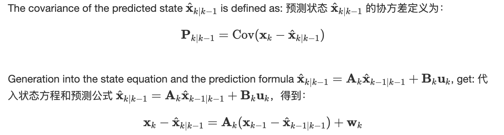

###### **3. Covariance expansion 协方差展开**
<!-- By using the properties of covariance  \(\text{Cov}(\mathbf{M}\mathbf{y}) = \mathbf{M} \text{Cov}(\mathbf{y}) \mathbf{M}^T\) and noise independence: 利用协方差的性质 \(\text{Cov}(\mathbf{M}\mathbf{y}) = \mathbf{M} \text{Cov}(\mathbf{y}) \mathbf{M}^T\) 和噪声独立性：
\[
\begin{aligned}
\mathbf{P}_{k|k-1} &= \text{Cov}\left( \mathbf{A}_k (\mathbf{x}_{k-1} - \hat{\mathbf{x}}_{k-1|k-1}) + \mathbf{w}_k \right) \\
&= \mathbf{A}_k \text{Cov}(\mathbf{x}_{k-1} - \hat{\mathbf{x}}_{k-1|k-1}) \mathbf{A}_k^T + \text{Cov}(\mathbf{w}_k) \\
&= \mathbf{A}_k \mathbf{P}_{k-1|k-1} \mathbf{A}_k^T + \mathbf{Q}_k.
\end{aligned}
\] -->
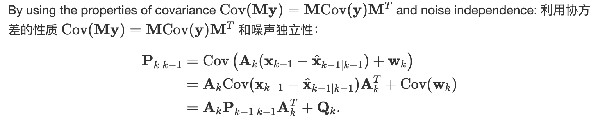

###### **4. Key Point Explanation 关键点解释**
<!-- - **\(\mathbf{A}_k \mathbf{P}_{k-1|k-1} \mathbf{A}_k^T\)**：  
  The state transition matrix \(\mathbf{A}_k\) maps the uncertainty \(\mathbf{P}_{k-1 | k-1}\) of the previous moment to the current moment and considers the influence of linear transformation on covariance. 状态转移矩阵 \(\mathbf{A}_k\) 将上一时刻的不确定性 \(\mathbf{P}_{k-1|k-1}\) 映射到当前时刻，并考虑线性变换对协方差的影响。
- **\(\mathbf{Q}_k\)**：  
  The additional uncertainty introduced by process noise, which is independent of the state estimation error. 过程噪声引入的额外不确定性，独立于状态估计误差。 -->
  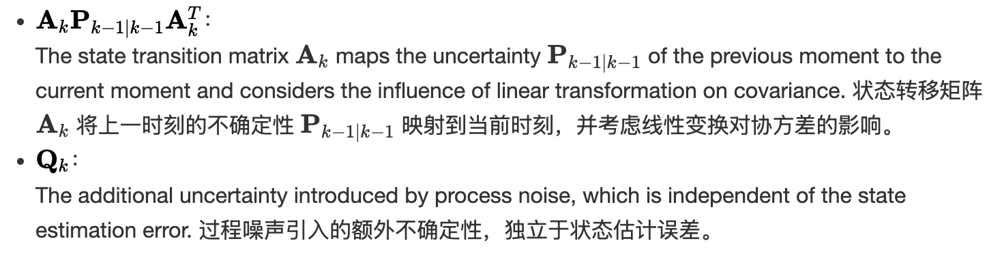

###### **5. Intuitive Understanding 直观理解**
<!-- - **Uncertainty Propagation 不确定性传播**：The error of state estimation propagates through system dynamics \(\mathbf{A}_k\), while superimposing the disturbance of process noise. 状态估计的误差通过系统动力学 \(\mathbf{A}_k\) 传播，同时叠加过程噪声的扰动。
- **高斯分布的线性变换**：线性系统中，高斯状态经过线性变换后仍为高斯分布，协方差按此规律更新。 -->
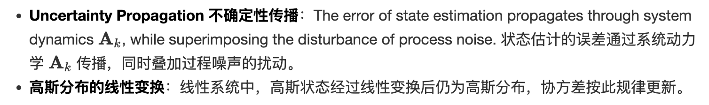

###### **6. Extended Scenarios 扩展场景**
<!-- - **Extended Kalman Filter（EKF）Nonlinear System 非线性系统**：  
  Use the Jacobian matrix \(\mathbf{F}_k\) instead of \(\mathbf{A}_k\), and approximately propagate the covariance after linearizing the local points: 使用雅可比矩阵 \(\mathbf{F}_k\) 代替 \(\mathbf{A}_k\)，在局部点线性化后近似传播协方差：
  \[
  \mathbf{P}_{k|k-1} = \mathbf{F}_k \mathbf{P}_{k-1|k-1} \mathbf{F}_k^T + \mathbf{Q}_k.
  \] -->
  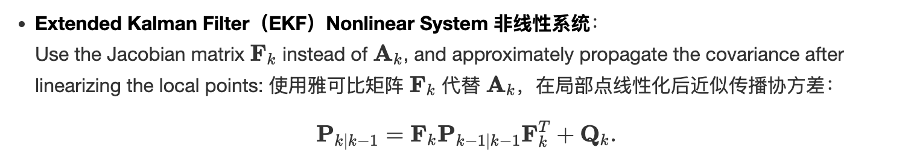

###### **Summary 总结**
This formula is one of the cores of the Kalman filter. It quantifies the uncertainty in the prediction stage through the covariance propagation of the linear transformation and the superposition of noise, providing a basis for subsequent measurement updates. 该公式是卡尔曼滤波的核心之一，通过**线性变换的协方差传播**和**噪声叠加**，量化预测阶段的不确定性，为后续的测量更新提供基础。

---

#### **3. Update Step 更新步骤**
#### **(1) Calculate the Kalman gain 计算卡尔曼增益**
<!-- \[
\mathbf{K}_{k} = \mathbf{P}_{k|k-1}\mathbf{H}_{k}^{T}(\mathbf{H}_{k}\mathbf{P}_{k|k-1}\mathbf{H}_{k}^{T} + \mathbf{R}_{k})^{-1}
\]
- **Symbol Definition 符号定义**：
  - \(\mathbf{K}_{k}\): 卡尔曼增益（权衡预测与测量的权重）。 Kalman gain (weighing the weights of prediction and measurement).
  - \(\mathbf{H}_{k}\): 观测矩阵（将状态映射到测量空间，如传感器只能观测位置而非速度）。Observation matrix (mapping states to the measurement space, such as sensors can only observe position rather than velocity).
  - \(\mathbf{R}_{k}\): 测量噪声协方差（传感器误差）。 Measure the noise covariance (sensor error).
- **Physical Significance 物理意义**：  
  - 分母 \(\mathbf{H}_{k}\mathbf{P}_{k|k-1}\mathbf{H}_{k}^{T} + \mathbf{R}_{k}\) 是**预测测量**的不确定性。  The denominator \(\mathbf{H}_{k}\mathbf{P}_{k|k-1}\mathbf{H}_{k}^{T} + \mathbf{R}_{k}\) is **prediction measurement uncertainty**.
  - Kalman gain decision more trust prediction (（\(\mathbf{K}_{k}\) small) or measurement (\(\mathbf{K}_{k}\) big). 卡尔曼增益决定更信任预测（\(\mathbf{K}_{k}\) 小）还是测量（\(\mathbf{K}_{k}\) 大）。 -->
  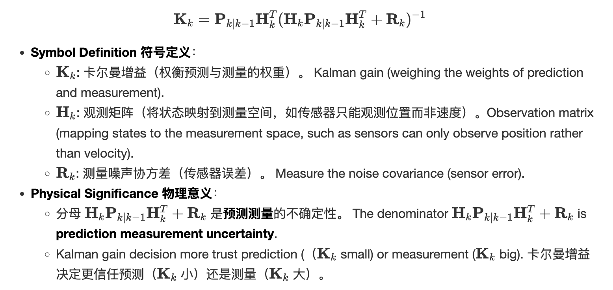

#### **(2) Update the State 状态更新**
<!-- \[
\hat{\mathbf{x}}_{k|k} = \hat{\mathbf{x}}_{k|k-1} + \mathbf{K}_{k}(\mathbf{z}_{k} - \mathbf{H}_{k}\hat{\mathbf{x}}_{k|k-1})
\]
- **Symbol Definition 符号定义**：
  - \(\hat{\mathbf{x}}_{k|k}\): Posterior state estimation (optimal estimation after fusion measurement). 后验状态估计（融合测量后的最优估计）。
  - \(\mathbf{z}_{k}\): Actual measured values (such as GPS readings). 实际测量值（如GPS读数）。
  - \(\mathbf{z}_{k} - \mathbf{H}_{k}\hat{\mathbf{x}}_{k|k-1}\): **"New interest"** (Innovation, the difference between measurement and prediction). **新息**（Innovation，测量与预测的差异）。
- **Physical Significance 物理意义**：  
  The prediction state is corrected through the new interest, and the correction amount is controlled by the Kalman gain. 通过新息修正预测状态，修正量由卡尔曼增益控制。 -->
  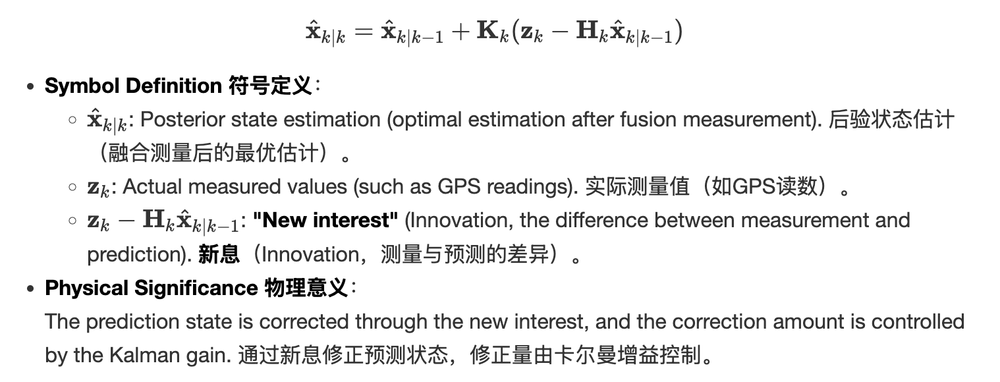

#### **(3) Covariance Update 协方差更新**
<!-- \[
\mathbf{P}_{k|k} = (\mathbf{I} - \mathbf{K}_{k}\mathbf{H}_{k})\mathbf{P}_{k|k-1}
\]
- **Symbol Definition 符号定义**：
  - \(\mathbf{P}_{k|k}\): Posterior covariance (updated uncertainty). 后验协方差（更新后的不确定性）。
  - \(\mathbf{I}\): Identity Matrix 单位矩阵。
- **Physical Significance 物理意义**：  
  The fusion of measurements leads to a reduction in state uncertainty （\(\mathbf{P}_{k|k} \leq \mathbf{P}_{k|k-1}\)）, as quantified by the updated covariance matrix. 融合测量后，状态的不确定性降低（\(\mathbf{P}_{k|k} \leq \mathbf{P}_{k|k-1}\)）。 -->
  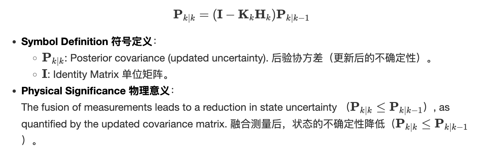


### **Symbol Summary Table 符号总结表**
<!-- | Symbol 符号                 | Implication 含义                          | Corresponding formula position 对应公式位置               |
|----------------------|-----------------------------|--------------------------|
| \(\hat{\mathbf{x}}\) | State estimation (with a hat indicating an estimated value) 状态估计（带帽子表示估计值）       | All state equations 所有状态方程              |
| \(\mathbf{P}\)       | State covariance matrix 状态协方差矩阵                 | Predict and update the covariance equation of the steps 预测和更新步骤的协方差方程  |
| \(\mathbf{A}\)       | State Transition Matrix 状态转移矩阵                   | State Prediction Equation 状态预测方程              |
| \(\mathbf{B}, \mathbf{u}\) | Control Input Matrix and Input Vector 控制输入矩阵和输入向量      | State Prediction Equation 状态预测方程              |
| \(\mathbf{Q}\)       | Process noise covariance 过程噪声协方差                 | Covariance prediction equation 协方差预测方程            |
| \(\mathbf{H}\)       | Measurement Matrix 观测矩阵                      | Kalman Gain and Update Equation 卡尔曼增益和更新方程       |
| \(\mathbf{R}\)       | The covariance of Measure Noise 测量噪声协方差                 | Kalman gain denominator 卡尔曼增益分母            |
| \(\mathbf{K}\)       | Kalman Gain 卡尔曼增益                    | State and Covariance Update Equation 状态和协方差更新方程       |
| \(\mathbf{z}\)       | practical Measured Value 实际测量值                    | The new information term in the State Update Equation 状态更新方程中的新息项     | -->
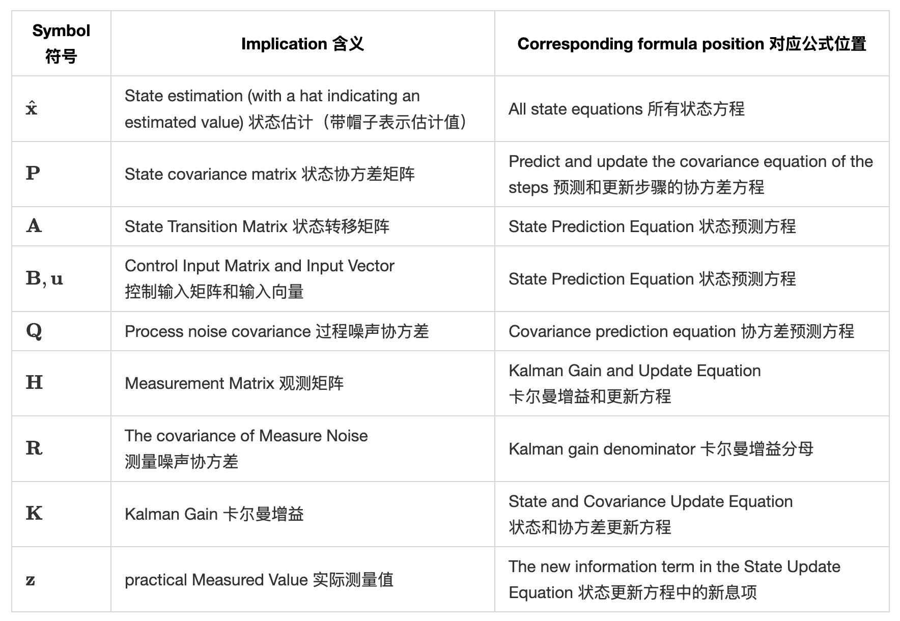


### **Intuitive Understanding 直观理解**
The Kalman filter gradually optimizes the estimation through the **prediction-update** cycle: 卡尔曼滤波通过**预测-更新**循环逐步优化估计：  
1. **Prediction 预测**：Predict the current state (including uncertainties) based on the model. 基于模型推测当前状态（含不确定性）。  
2. **Update 更新**：The prediction is corrected with actual measurements, and the weights are dynamically adjusted by Kalman gain. 用实际测量修正预测，权重由卡尔曼增益动态调整。  
3. **Core Idea 核心思想**：Optimal estimation is achieved through probabilistic fusion of Gaussian distributions. 通过高斯分布的概率融合，实现最优估计。  

**Example 举例**：  
- Robot positioning: Predicted position (including error) + GPS measurement (including noise) → More accurate position estimation. 机器人定位：预测位置（含误差） + GPS测量（含噪声） → 更精确的位置估计。

#### 1.4.1.5.2. EKF and UKF Adaptations

- **EKF:** Incorporate Jacobians in prediction and update steps. 在预测和更新步骤中加入雅可比矩阵。
- **UKF:** Use sigma points to approximate the distributions. 用sigma点来近似分布。


### 1.4.1.6. Practical Considerations

#### 1.4.1.6.1. Tuning the Filter 微调滤波器

- **Process Noise Covariance (\(\mathbf{Q}\)):** Adjust to reflect how much uncertainty is in the model. 调整以反映模型中有多少不确定性。
- **Measurement Noise Covariance (\(\mathbf{R}\)):** Set based on the accuracy of the sensors. 根据传感器的精度设置。

#### 1.4.1.6.2. Initialization 初始化

- **State Estimate:** Should be as close as possible to the true initial state. 应该尽可能接近真实的初始状态。
- **Covariance Matrix:** Reflect the confidence in the initial estimate. 反映对初始估计的信心。

#### 1.4.1.6.3. Numerical Stability 数值稳定性

- **Covariance Matrix Symmetry 协方差矩阵对称性:** Ensure that \(\mathbf{P}\) remains symmetric and positive semi-definite. 确保\(\mathbf{P}\)保持对称和正半确定性。
- **Avoiding Divergence 避免发散:** Monitor innovations (measurement residuals) to detect divergence. 监测新息（测量残差）以检测差异。


As the conclusion, the Kalman Filter and its variants are powerful tools for state estimation in various systems, especially when dealing with uncertainties and noise. By selecting the appropriate variant based on the system's characteristics and application requirements, one can achieve robust and accurate estimation results. 综上所述，卡尔曼滤波器及其变体是各种系统状态估计的有力工具，特别是在处理不确定性和噪声时。通过根据系统的特点和应用需求选择合适的变量，可以获得鲁棒和准确的估计结果。

Understanding the mathematical foundations, assumptions, and limitations of each filter variant is crucial for successful implementation. Continuous advancements in filter design and computation methods are expanding their applicability to increasingly complex and nonlinear systems. 了解每个过滤器变体的数学基础、假设和限制对于成功实现至关重要。滤波器设计和计算方法的不断进步扩大了它们在日益复杂和非线性系统中的适用性。


### 1.4.2 Computer Vision - 计算机视觉 <a id="Scene-Understanding"></a>

#### 1.4.2.1 2D Vision - 二维视觉 <a id="2D-Vision"></a>


#### 1.4.2.2 3D Vision - 三维视觉 <a id="3D-Vision"></a>


#### 1.4.2.3 4D Vision - 四维视觉 <a id="4D-Vision"></a>
 

#### 1.4.2.4 Subdivision of Application Domains - 应用领域细分 <a id="Subdivision-of-application-domains"></a>

##### 1.4.2.4.1 Visual Prompting - 视觉提示 <a id="Visual-Prompting"></a>


##### 1.4.2.4.2 Affordance Grounding - 可供性锚定 <a id="Affordance-Grounding"></a>

###### 1.4.2.4.2.1 2D - 二维 <a id="Two-Dimension"></a>


###### 1.4.2.4.2.2 3D - 三维 <a id="Three-Dimension"></a>


### 1.4.2 Scene Understanding - 场景理解 <a id="Scene-Understanding"></a>

#### 1.4.2.1 Segmentation - 图像分割 <a id="Segmentation"></a>


## 1.5 Learning - 学习 <a id="Learning"></a>

### 1.5.1 Intro to Machine Learning - 机器学习入门 <a id="Intro-to-Machine-Learning"></a>
 

### 1.5.2 Reinforcement Learning - 强化学习 <a id="Reinforcement-Learning"></a>


### 1.5.3 Imitation Learning - 模仿学习 <a id="Imitation-Learning"></a>


## 1.6 Multi-Robot Systems - 多机器人系统 <a id="Multi-Robot-Systems"></a>


## 1.7 Simulation and Modeling - 仿真与建模 <a id="Simulation-and-Modeling"></a>


## 1.8 Physical Interaction - 物理交互 <a id="Physical-Interaction"></a>


## 1.9 Ethics and Social Implications - 伦理与社会问题 <a id="Ethics-and-Social-Implications"></a>


# 2. Tools - 工具 <a id="tools"></a>

## 2.1 Software - 软件 <a id="software"></a>

### 2.1.1 General Tools - 常用工具 <a id="General-Tools"></a>


### 2.1.2 Simulators - 仿真器 <a id="simulators"></a>


### 2.1.3 Robot Description - 机器人描述格式 <a id="Robot-Description"></a>

**"URDF, Xacro, or MJCF formats"** are file formats used to describe the object models in robots or simulation environments, and are usually referred to as **robot model files** or **robot description formats**. They are mainly used for robot simulation, control and rendering, and are common model description methods in robotics and simulators. The following is a detailed explanation:
**“URDF, Xacro, or MJCF formats”** 是用于描述机器人或仿真环境中的物体模型的文件格式，通常被称为**机器人模型文件**或**机器人描述格式**。它们主要用于机器人仿真、控制和渲染，是机器人学和仿真器中常见的模型描述方式。以下是详细解释：

#### **2.1.3.1. Introduction 介绍**

##### **2.1.3.1.1 URDF (Unified Robot Description Format)**
  - **Terminology 全称**：Unify the description format of robots. 统一机器人描述格式。
  - **Function 作用**：URDF is an XML-based file format used to describe the physical structure, kinematics, dynamics, geometry and joint configuration of robots. URDF 是一种基于 XML 的文件格式，用于描述机器人的物理结构、运动学、动力学、几何形状和关节配置。
  - **Application 用途**：
    - Define the structure and attributes of the robot model. 定义机器人模型的结构和属性。
    - Load the robot in a simulator (such as Gazebo). 在仿真器（如 Gazebo）中加载机器人。
    - It is used for visualization and control in the Robot Operating System (ROS). 在机器人操作系统（ROS）中用于可视化和控制。
  - **Content 内容**：
    This includes the geometry, size, mass, inertia, joint type (such as rotary joints, sliding joints) and connection method of each component of the robot. 包括机器人每个部件的几何形状、大小、质量、惯性、关节类型（如旋转关节、滑动关节）及其连接方式。

##### **2.1.3.1.2 Xacro (XML Macros)**
- **Terminology 全称**：XML Macros(XML 宏)。
- **Function 作用**：Xacro is an extended XML format specifically designed to simplify the writing of URDF files. Xacro 是一种扩展的 XML 格式，专门为简化 URDF 文件的编写而设计。
- **Characteristic 特点**：
  - 通过 **宏定义** 和 **参数化** 来减少重复代码。 Reduce repetitive code through **macro definitions** and **parameterization**.
  - 提高复杂机器人模型的可读性和可维护性。 Improve the readability and maintainability of complex robot models.

- **Application 用途**：
  - Generate dynamic or complex URDF files. 生成动态或复杂的 URDF 文件。
  - It is widely used in ROS to generate parametric robot descriptions. 在 ROS 中广泛用于生成参数化的机器人描述。

##### **2.1.3.1.3 MJCF (MuJoCo XML Format)**
- **Terminology 全称**：MuJoCo（Multi-Joint Dynamics with Contact）描述格式。
- **Function 作用**：MJCF is an XML format dedicated to the MuJoCo simulator, used to define the dynamic models of robots or environments. MJCF 是 MuJoCo 仿真器专用的 XML 格式，用于定义机器人或环境的动力学模型。
- **Characteristic 特点**：
  - It focuses on physical simulation and supports high-precision dynamic calculations. 侧重物理仿真，支持高精度的动力学计算。
  - It is able to define complex joint systems, contact models, controllers, etc. can be defined. 可定义复杂的关节系统、接触模型、控制器等。
- **Application 用途**：
  - Load the robot model in the MuJoCo simulator. 在 MuJoCo 仿真器中加载机器人模型。
  - It is used for reinforcement learning and robot control research. 用于强化学习和机器人控制研究。


#### **2.1.3.2. Application 用途**

These formats are typically used to describe **object models in robots or simulation environments**, including: 这些格式通常用于描述**机器人或仿真环境中的物件模型**，包括：
1. **Physical model of the robot 机器人物理模型**：
   - Define the shape, size, position, joint type, etc. of each component of the robot. 定义机器人各部件的形状、大小、位置、关节类型等。
   - Including various robot models such as robotic manipulations, wheeled robots, quadruped robots, etc.包括机器人臂、轮式机器人、四足机器人等各种机器人模型。
2. **Environment Description 环境描述**：
   - Define other objects in the simulation environment, such as obstacles, terrain, furniture, etc. 定义仿真环境中的其他物体，比如障碍物、地形、家具等。
3. **Dynamics and kinematics simulation 动力学和运动学仿真**：
   - Define the physical properties of the robot (such as mass and inertia tensor) and joint motion limitations for high-precision simulation in physical simulators (such as Gazebo and MuJoCo). 定义机器人的物理属性（如质量、惯性张量）和关节运动限制，用于物理仿真器（如 Gazebo、MuJoCo）中进行高精度仿真。
4. **Visualization 可视化**：
   - It is used to visualize robot models and help developers understand the structure and movement behavior of robots. 用于可视化机器人模型，帮助开发者理解机器人结构和运动行为。
5. **机器人控制 Robot Control**：
   - Import the model into the control system for tasks such as path planning and motion control. 将模型导入到控制系统中，用于路径规划、运动控制等任务。


#### **2.1.3.3. Category 类别**

These formats can be classified as **"object model description files in robot simulators"**, but more accurate terms include: 可以将这些格式归类为 **机器人仿真器中的物件模型描述文件**，但更准确的术语包括：

##### **2.1.3.3.1 Robot description format 机器人描述格式**
- They are file formats specifically designed to describe the structure, kinematics and dynamics of robots. 它们是专门用于描述机器人结构、运动学和动力学的文件格式。

##### **2.1.3.3.2 Simulation environment model 仿真环境模型**
- In addition to the robots themselves, they can also describe objects in the simulation environment, and thus can also be classified as **"object model description files in the simulator"**. 除了机器人本身，它们也可以描述仿真环境中的物体，因此也可以归为 **仿真器中的物件模型描述文件**。


#### **2.1.3.4. Relationship and Differences 关系与区别**

| **format 格式**  | **Describing object 描述对象**               | **Characteristic 特点**                                                                                       | **Scenarios 常用场景**                          |
|-----------|----------------------------|------------------------------------------------------------------------------------------------|---------------------------------------|
| **URDF**  | robot model 机器人模型                | 简单、直接，适合静态和基本的机器人描述。 Simple and straightforward, suitable for static and basic robot descriptions.                                                       | ROS中的机器人建模与仿真。            |
| **Xacro** | Parametric robot model 参数化机器人模型          | XML-macro-extension-based URDF is more suitable for the description of complex robot models and supports code reuse and dynamic generation. 基于 XML 宏扩展的 URDF，更适合复杂机器人模型的描述，支持代码复用和动态生成。                     | Generate complex URDF files for ROS simulation. 生成复杂 URDF 文件，用于 ROS 仿真。   |
| **MJCF**  | Robots and environmental models 机器人和环境模型          | Emphasizing dynamic simulation, supporting complex contact modeling, it is more often used in reinforcement learning and robot control research. 强调动力学仿真，支持复杂的接触建模，更多用于强化学习和机器人控制研究。                          | MuJoCo 仿真器（如 OpenAI Gym 环境）。 |


#### **2.1.3.5. Usage tools and Simulator support 它们的使用工具和仿真器支持**

- **URDF 和 Xacro**：
  - **Support Tool 支持工具**：ROS（Robot Operating System）。
  - **Support Simulator 支持仿真器**：CoppeliaSim(V-ERP), Gazebo、RViz 等 ROS 生态中的工具。 Tools in the ROS ecosystem such as CoppeliaSim(V-ERP), Gazebo, and RViz.
- **MJCF**：
  - **Support Tool 支持工具**：MuJoCo（Multi-Joint Dynamics with Contact）。
  - **Support Simulator 支持仿真器**：MuJoCo 仿真器，常与 OpenAI Gym 和强化学习框架结合使用。 The MuJoCo simulator, often used in combination with OpenAI Gym and reinforcement learning frameworks.


#### **2.1.3.6. Sample Files 示例文件**

##### **URDF Example 示例**
```xml
<robot name="simple_robot">
  <link name="base_link">
    <inertial>
      <mass value="1.0"/>
      <origin rpy="0 0 0" xyz="0 0 0"/>
      <inertia ixx="1.0" ixy="0" ixz="0" iyy="1.0" iyz="0" izz="1.0"/>
    </inertial>
    <visual>
      <geometry>
        <box size="1 1 1"/>
      </geometry>
    </visual>
  </link>
</robot>
```

##### **Xacro Example 示例**
```xml
<?xml version="1.0"?>
<robot xmlns:xacro="http://www.ros.org/wiki/xacro" name="param_robot">
  <xacro:property name="length" value="1.0"/>
  <link name="base_link">
    <visual>
      <geometry>
        <box size="${length} ${length} ${length}"/>
      </geometry>
    </visual>
  </link>
</robot>
```

##### **MJCF Example 示例**
```xml
<mujoco>
  <worldbody>
    <body name="box" pos="0 0 0">
      <geom type="box" size="0.5 0.5 0.5" rgba="1 0 0 1"/>
    </body>
  </worldbody>
</mujoco>
```


#### **2.1.3.7. Conclusion 总结**

- **URDF, Xacro, MJCF** are model description files ** used to describe robots and simulation environments. **URDF, Xacro, MJCF** 是用于描述机器人和仿真环境的**模型描述文件**。
- **URDF/Xacro** : Mainly used in ROS and Gazebo simulation environments, focusing on robot modeling. **URDF/Xacro**：主要用于 ROS 和 Gazebo 仿真环境，专注于机器人建模。
- **MJCF** : Used in the MuJoCo simulator, it focuses on high-precision dynamic simulation. **MJCF**：用于 MuJoCo 仿真器，专注于高精度动力学仿真。
- They are key tools for defining robot or object models in robot simulators and can be simply understood as **"object model description files in the simulator"**. 它们是机器人仿真器中定义机器人或物件模型的关键工具，可以简单理解为 **“仿真器中的物件模型描述文件”**。


## 2.2 Hardware - 硬件 <a id="hardware"></a>


# 3. Literature Review - 文献综述 <a id="literature-review"></a>

## 3.1 Traditional Control - 传统控制 <a id="Traditional-Control"></a>

- A manipulator-assisted multiple UAV landing system for USV subject to disturbance 
*R. Xu, C. Liu, Z. Cao, Y. Wang and H. Qian; Ocean Engineering 2024 Vol. 299 Pages 117306; DOI: 10.1016/j.oceaneng.2024.117306*

## 3.2 Model Predictive Control - 模型预测控制 <a id="Model-Predictive-Control"></a>

- Implementation of Nonlinear Model Predictive Path-Following Control for an Industrial Robot 
*T. Faulwasser, T. Weber, P. Zometa and R. Findeisen; IEEE Transactions on Control Systems Technology 2017 Vol. 25 Issue 4 Pages 1505-1511; DOI: 10.1109/tcst.2016.2601624*

---

- Trajectory Generation for Multiagent Point-To-Point Transitions via Distributed Model Predictive Control 
*C. E. Luis and A. P. Schoellig; IEEE Robotics and Automation Letters 2019 Vol. 4 Issue 2 Pages 375-382; DOI: 10.1109/lra.2018.2890572*

---

- Predictive End-Effector Control of Manipulators on Moving Platforms Under Disturbance 
*J. Woolfrey, W. Lu and D. Liu; IEEE Transactions on Robotics 2021 Vol. 37 Issue 6 Pages 2210-2217; DOI: 10.1109/tro.2021.3072544*

---

- Confidence-Aware Object Capture for a Manipulator Subject to Floating-Base Disturbances 
*R. Xu, Z. Jiang, B. Liu, Y. Wang and H. Qian; IEEE Transactions on Robotics 2024 Vol. 40 Pages 4396-4413; DOI: 10.1109/tro.2024.3463476*

  **想解决的问题**

  本论文旨在解决在波浪扰动下，无人艇（USV）上的机械臂捕获空中静止目标（如无人机）的问题。由于波浪引起的基座运动是准周期且快速的，导致目标运动预测精度低，以及机械臂受限的主动力矩使得实时追踪和捕获目标变得困难。传统的方法依赖于准确的运动预测和足够的执行器力矩，然而这些条件在实际中很难满足。

  **具体做法**

  *算法部分：*

  1. **运动预测与置信度评估：**
    - **波レット网络（Wavelet Network, WN）预测：** 使用实时训练的WN来预测目标在基座坐标系下的运动轨迹。WN能有效捕捉波浪扰动下的非线性和不确定性。
    - **置信度分析：** 为了评估预测质量，采用贝叶斯方法计算预测的置信度。得到一个实时的置信度区间（confidence tube），用于多步预测的准确性评估。

  2. **置信度感知的运动规划：**
    - **捕获位置选择：** 在预测的轨迹上选择一个置信度最高的捕获位置，通过最大化捕获位置的置信度，确定最佳的捕获时刻。
    - **运动轨迹规划：** 形成一个非线性优化问题，生成机械臂在任务空间中的捕获轨迹。该优化同时考虑了捕获的置信度和机械臂的运动可行性。
    - **计算效率提升：** 为了保证实时性（在0.2秒内完成所有计算），将优化问题拆分为两个更简单的问题：首先求解捕获位置，然后规划运动轨迹。

  *系统（设计）部分：*

  - **机械臂系统设计：** 使用一个冗余度较高的机械臂，安装在伺服平台上，以模拟浮动基座的扰动。机械臂末端配备电磁铁，能够在接触到目标后立即捕获。
  - **实验平台搭建：** 在实验中，利用真实的无人艇运动数据，通过伺服平台再现基座的六自由度运动，包括滚转、俯仰、偏航、推进、横移和升沉。
  - **传感与控制系统：** 使用运动捕捉系统实时获取目标和基座的位置和姿态信息。控制系统基于ROS架构，以高频率（1kHz）在关节位置层面控制机械臂。

  **效果**

  - **实验验证：** 通过模拟和实际实验，验证了所提方法的有效性。在进行了超过150次实验后，结果显示：
    - **成功率：** 在基座执行真实无人艇运动的情况下，所提方法实现了80%的捕获成功率。
    - **精度提升：** 相较于传统方法，捕获精度显著提高，均方误差（MAE）降低了25%以上。
    - **鲁棒性：** 即使在预测精度无法持续保持的情况下，通过置信度评估和初始化方法，提高了捕获的可靠性。

  **关键词**
  - 置信度分析，浮动基座机械臂，运动规划，目标捕获，波レット网络，贝叶斯方法，实时控制，无人艇，自动化系统

<!-- --- -->

<!-- ##
- Confidence-Aware Object Capture for a Manipulator Subject to Floating-Base Disturbances 
*R. Xu, Z. Jiang, B. Liu, Y. Wang and H. Qian; IEEE Transactions on Robotics 2024 Vol. 40 Pages 4396-4413; DOI: 10.1109/tro.2024.3463476* -->


## 3.3 Vision Language Model - 视觉-语言模型 <a id="Vision-Language-Model"></a>


## 3.4 Vision Language Action Model - 视觉-语言-动作模型 <a id="Vision-Language-Action"></a>


## 3.5 Dual System - 双系统 <a id="Dual-System"></a>


# 4. Paper List Links - 论文列表链接 <a id="paper-list-link"></a>
- [Awesome-LLM-Robotics: A repo contains a curative list of papers using Large Language/Multi-Modal Models for Robotics/RL](https://github.com/GT-RIPL/Awesome-LLM-Robotics)
- [SOTA Paper Rating - Weiyang Jin](https://waynejin0918.github.io/SOTA-paper-rating.io/)
- [Paper List For EmbodiedAI - Tianxing Chen](https://github.com/TianxingChen/Paper-List-For-EmbodiedAI)
- [Paper List - Yanjie Ze](https://github.com/YanjieZe/Paper-List)


# 5. Acknowledgement - 致谢 <a id="acknowledgement"></a>
>文中部分内容可能包括我们有access权限但是不对公众开放的内容（比如部分论文的PDF），仅做学术分享，如有侵权，请您第一时间联系我们删除。请勿将本仓库中的任何内容用作商业目的。如有相应部分因我们疏忽（比如引用了相关的内容但是忘记标明出处），请麻烦联系我们，我们会第一时间进行update。

本文转载/引用了一下一些团体/个人的内容，我们对他们的贡献表示感谢，以下是引用列表：

[1] Course Materials from CUHK, Shenzhen [Introduction to Robotics](https://github.com/yimouwu/Robotics-and-Embodied-AI-Review/tree/main/Awesome%20Course%20Materials/Introduction%20to%20Robotics)，[2] Feishu Docs [Xbot具身知识库](https://yv6uc1awtjc.feishu.cn/wiki/WPTzw9ON0ivIVrkLjVocNZh8nLf?from=from_copylink)，[3] Github repo [Embodied-AI-Guide](https://github.com/TianxingChen/Embodied-AI-Guide)，[4] Github repo [Awesome-Embodied-AI](https://github.com/yunlongdong/Awesome-Embodied-AI)

####
# About us - 关于我们
###### "己欲立而立人，己欲达而达人"
我们是一个由机器人与具身初学者组成的团队, 希望能够通过我们自己的学习、科研经验, 为志同道合的朋友提供一些帮助。欢迎更多朋友加入我们的项目, 也很欢迎交友、学术合作, 有任何问题, 可以联系邮箱`yimouwu0@gmail.com`。

<p><b>🎠Contributors</b>: <a href="https://yimouwu.github.io/">吴贻谋 (25'港中文MPhil)</a> 
</p> 

<a href="https://github.com/yimouwu/Robotics-and-Embodied-AI-Review/contributors">
  
</a>

#####
> 关于本仓库的知识讨论，或者任何其他问题,欢迎联系吴贻谋（25'fall CUHK 医学院外科系 MPhil，方向为机器人（医疗）与具身智能）微信：yimouwu777 或者 邮箱：yimouwu0@gmail.com

# 👍 Citation <a id="citation"></a>

如果本仓库对你的研究或学习有所帮助，请引用：
```bibtex
@misc{roboticsandembodiedaireview2025,
  title     = {Robotics-and-Embodied-AI-Review},
  author    = {Robotics-and-Embodied-AI-Review-Contributors},
  month     = {June},
  year      = {2025},
  url       = {https://github.com/yimouwu/Robotics-and-Embodied-AI-Review},
}
```


# 🏷️ License <a id="license"></a>

This repository is released under the MIT license. See [LICENSE](./LICENSE) for additional details.


# ⭐️ Star History <a id="star-history"></a>

## Star History
[](https://www.star-history.com/#yimouwu/Robotics-and-Embodied-AI-Review&Date)


<!-- ---

## **3. 机器学习与强化学习 (Machine Learning and Reinforcement Learning)**

### **中文**
**机器学习**是通过数据训练模型以完成任务的技术，而**强化学习**是一种特殊的机器学习方法，旨在通过试错学习找到最优策略，以最大化长期奖励。

- **机器学习**：
  - 分类：监督学习、无监督学习、半监督学习。
  - 常用模型：支持向量机、决策树、神经网络。
  - 应用：目标检测、语音控制、路径规划。
- **强化学习**：
  - 使用**奖励信号**进行学习。
  - 框架：基于 MDP，策略优化（如 Q-learning 和深度强化学习）。
  - 应用：机器人控制、自动驾驶、游戏 AI。

### **English**
**Machine Learning** involves training models using data to perform tasks, while **Reinforcement Learning** is a special branch of machine learning that focuses on finding optimal policies through trial and error to maximize long-term rewards.

- **Machine Learning**:
  - Categories: Supervised, unsupervised, and semi-supervised learning.
  - Common models: SVMs, decision trees, neural networks.
  - Applications: Object detection, voice control, path planning.
- **Reinforcement Learning**:
  - Learns through **reward signals**.
  - Framework: Based on MDP, policy optimization (e.g., Q-learning and deep RL).
  - Applications: Robot control, autonomous driving, game AI.

---

## **4. 动力学与控制 (Dynamics and Control)**

### **中文**
机器人学中的**动力学与控制**研究如何在物理环境中描述和控制机器人运动。它是实现精确操作和稳定行为的核心。

- **动力学**：
  - 使用牛顿力学或拉格朗日力学描述机器人运动。
  - 包括刚体动力学、关节运动学。
- **控制方法**：
  - PID 控制：经典的比例-积分-微分控制。
  - Model Predictive Control (MPC)：前瞻性优化控制方法。
- **应用**：
  - 机械臂轨迹控制。
  - 轮式机器人运动控制。

### **English**
**Dynamics and Control** in robotics focus on describing and controlling robot motion in physical environments. It is essential for achieving precise operations and stable behaviors.

- **Dynamics**:
  - Describes robot motion using Newtonian or Lagrangian mechanics.
  - Includes rigid body dynamics and joint kinematics.
- **Control Techniques**:
  - PID Control: Classical proportional-integral-derivative control.
  - Model Predictive Control (MPC): A forward-looking optimization method.
- **Applications**:
  - Trajectory control of robotic arms.
  - Motion control of wheeled robots.

---

## **5. SLAM（同步定位与建图）**

### **中文**
**同步定位与建图 (SLAM)** 是机器人在未知环境中构建地图并同时确定自身位置的关键技术。

- **核心问题**：
  - 机器人如何同时**构建地图**和**定位自身**？
- **常见方法**：
  - 激光雷达 SLAM（如 Gmapping、Cartographer）。
  - 视觉 SLAM（如 ORB-SLAM、RTAB-Map）。
- **应用**：
  - 无人驾驶。
  - 室内导航。

### **English**
**Simultaneous Localization and Mapping (SLAM)** is a key technique that enables robots to construct a map of an unknown environment while simultaneously determining their own position.

- **Core Problem**:
  - How can the robot **build a map** and **locate itself** at the same time?
- **Common Methods**:
  - LiDAR-based SLAM (e.g., Gmapping, Cartographer).
  - Vision-based SLAM (e.g., ORB-SLAM, RTAB-Map).
- **Applications**:
  - Autonomous driving.
  - Indoor navigation.

---

## **6. 具身智能中的认知与交互**

### **中文**
具身智能不仅关注机器人的物理行为，还强调与环境和人类的交互能力，包括感知、学习、决策和语言理解。

- **感知**：通过传感器（如相机、激光雷达）感知环境。
- **交互**：实现自然语言处理、手势识别等。
- **学习**：通过深度学习或强化学习改进行为。

### **English**
Embodied intelligence focuses not only on the robot's physical actions but also on its ability to interact with the environment and humans, including perception, learning, decision-making, and language understanding.

- **Perception**: Using sensors (e.g., cameras, LiDAR) to perceive the environment.
- **Interaction**: Achieving natural language processing, gesture recognition, etc.
- **Learning**: Improving behavior through deep learning or reinforcement learning.

---

### **总结 (Summary)**

机器人学和具身智能的基础知识可以分为以下关键领域（Key Areas）：

1. **马尔可夫过程 (Markov Process)**：描述随机系统的演化。
2. **卡尔曼滤波 (Kalman Filter)**：优化动态系统状态估计。
3. **机器学习与强化学习 (Machine Learning & RL)**：实现智能控制与决策。
4. **动力学与控制 (Dynamics & Control)**：描述和控制机器人运动。
5. **SLAM**：同步定位与建图。
6. **认知与交互 (Cognition & Interaction)**：机器人与环境、人类的智能交互。

这些知识构成了机器人学与具身智能的理论和技术基础，无论是用于研究还是工程应用，都十分重要。 -->